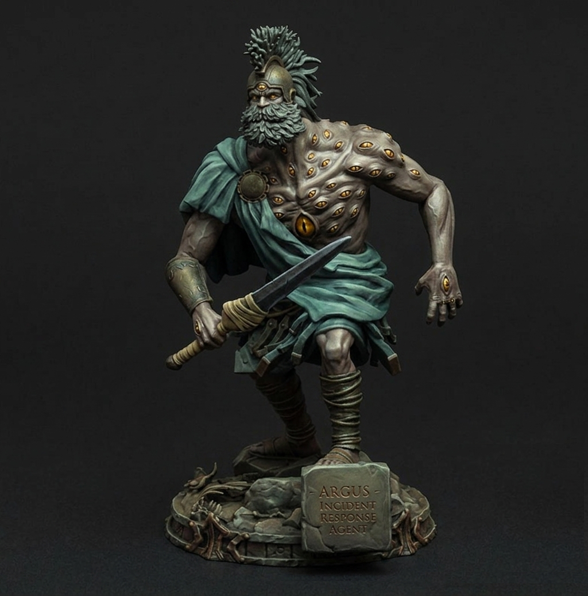

<p align="center">
  
</p>

<h1 align="center">Argus</h1>
<p align="center"><em>An autonomous incident-response agent.</em></p>

---

## Problem

Production systems generate more alerts than humans can triage. Today an on-call engineer reads the alert, correlates it with recent changes (deploys, flags, config), forms a hypothesis, mitigates, finds root cause, fixes it, and documents it - slow and inconsistent across engineers.

## What Argus is

Argus receives an alert via webhook and runs that workflow autonomously: investigate, mitigate reversible causes, propose a code fix, report status live, and produce a postmortem once resolved - escalating to a human whenever it isn't confident enough to act. It's not "a chatbot with tools": it reasons under uncertainty, takes real (reversible) actions, tracks its own hypothesis history to avoid repeating failed attempts, and knows when to stop and hand off.

Argus is a **multi-agent system**: an orchestrator delegates to specialized sub-agents (Investigator, Mitigation, Code-Fix, Communicator, Postmortem) that investigate alerts, take reversible mitigation actions, propose code fixes via PR, and write postmortems - against a self-contained Target Service and Target Environment it builds and controls, not real infrastructure.

This project is the team course project for [The AI Institute](https://www.theinstituteai.org.il/en/the-institute-and-ben-gurion-university/)'s program (in partnership with Ben-Gurion University), taught by Tamar - built around the course's three pillars: software engineering methodologies (spec-driven and test-driven development), practical AI tooling (the Claude ecosystem, agent frameworks), and the theory needed to reason about what's actually being built.

## Development conventions: TDD

This project follows strict test-driven development: **tests are a human-owned contract, and AI coding agents are structurally blocked from writing to any `tests/` directory.** Claude Code (or any other AI agent working in this repo) cannot create, edit, or delete files under `tests/`, `modules/*/tests/`, or `benchmark/tests/` - enforced mechanically, not just by convention. An agent proposes a test as text/diff in conversation; a human adds it by hand; only then does the agent implement against it.

See [`AGENTS.md`](AGENTS.md) for the full, tool-agnostic policy and its rationale, and [`CLAUDE.md`](CLAUDE.md) for Claude-Code-specific project conventions.

## Architecture at a glance

- **`argus_web`** - the only HTTP surface. Receives the alert webhook, normalizes it into Argus's own domain object (currently: a deterministic Grafana unified-alerting parser), and calls the Orchestrator in-process.
- **`orchestrator`** - a LangGraph `StateGraph` implementing the incident state machine (`investigating -> mitigating -> resolved`, with `fixing`/`escalated` branches), Postgres-backed and checkpointed.
- **`agent_investigator`, `agent_mitigation`, `agent_codefix`, `agent_communicator`, `agent_postmortem`** - the five sub-agents, each its own workspace package.
- **`argus_core`** - shared domain models, Postgres schema, and configuration.

Full component-by-component detail, the data model, the tool-integration strategy, and every locked-in design decision are in [`docs/spec-and-architecture.md`](docs/spec-and-architecture.md).

## Repository structure

This is a [`uv` workspace](https://docs.astral.sh/uv/concepts/workspaces/) - each module under `modules/` is an independently versioned package with its own `pyproject.toml`:

```
modules/
├── argus_core/           # shared models, Postgres schema, config
├── argus_web/            # HTTP surface: alert webhook
├── orchestrator/         # LangGraph StateGraph, incident FSM
├── agent_investigator/
├── agent_mitigation/
├── agent_codefix/
├── agent_communicator/
└── agent_postmortem/

tests/
├── e2e/                  # full stack via docker-compose
├── integration/          # cross-module, in-process
└── contract/             # MCP tool-schema contract tests

docs/spec-and-architecture.md   # the spec - source of truth
openspec/                       # change proposals, design docs, delta specs
```

## Getting started

**Prerequisites:** Python 3.14, [`uv`](https://docs.astral.sh/uv/), Docker.

```bash
uv sync --all-packages
```

Run the full end-to-end suite (brings up Postgres and `argus_web`, runs the tests, tears both down):

```bash
uv run python -m nox -s e2e
```

Other useful sessions - `uv run python -m nox --list` shows the full set:

```bash
uv run python -m nox -s lint              # ruff, whole repo
uv run python -m nox -s typecheck         # mypy --strict, modules/
uv run python -m nox -s "test_module(module='<name>')"  # one module's unit/integration tests
uv run python -m nox -s guard_e2e_boundary             # enforces e2e-test placement rules
```

## Configuration

Argus reads its Postgres connection from the environment (see `argus_core/config.py`):

| Variable | Default |
|---|---|
| `DATABASE_USER` | `argus` |
| `DATABASE_PASSWORD` | `argus` |
| `DATABASE_HOST` | `localhost` |
| `DATABASE_PORT` | `5432` |

Defaults match the local `docker-compose.yml` Postgres service - no setup needed for local dev. For anything else, drop overrides in a `.env` file at the repo root (already gitignored) or set real environment variables at deploy time; nothing sensitive is ever hardcoded.
