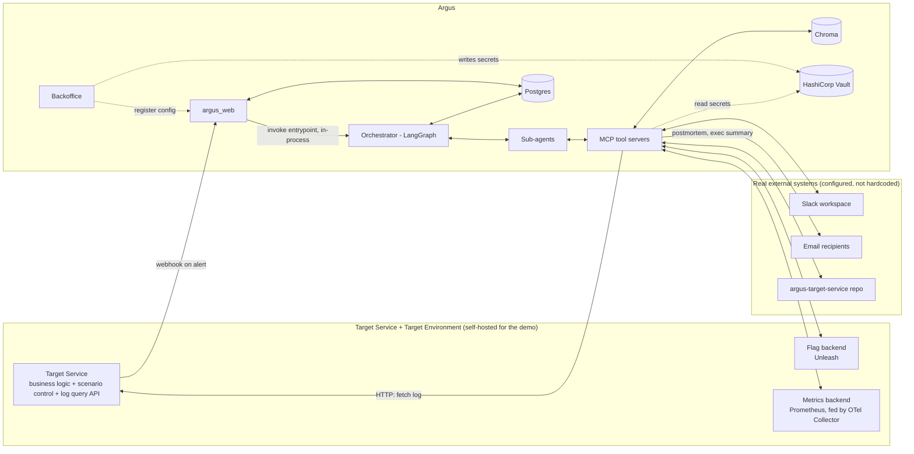
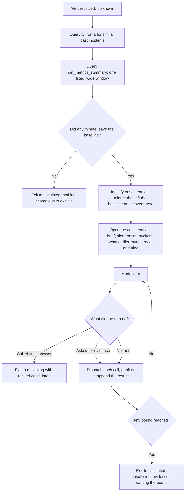
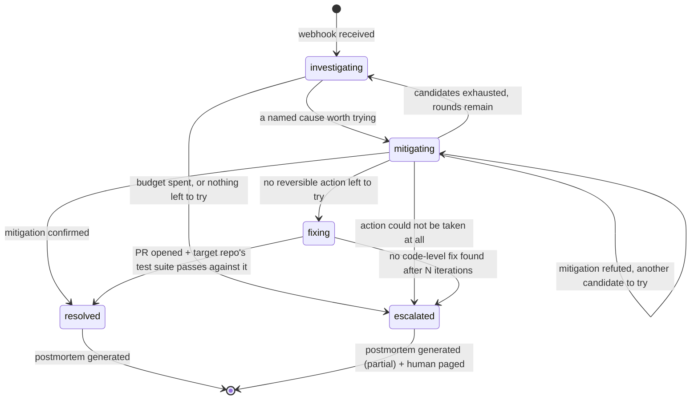
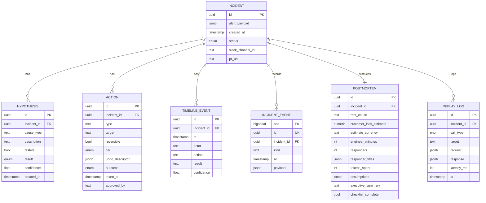
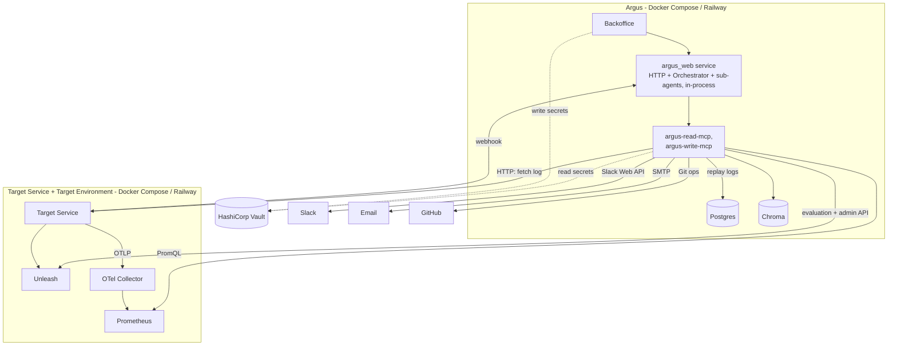

# Argus - Autonomous Incident Response Agent
### Project Spec & Architecture (v1)

> Unified spec: product requirements and technical design in one doc. All `§N` refer to sections of this document.

---

## 1. Problem Statement

Production systems generate more alerts than humans can triage. Today an on-call engineer reads the alert, correlates it with recent changes (deploys, flags, config), forms a hypothesis, mitigates, finds root cause, fixes it, and documents it - slow and inconsistent across engineers.

**Argus** receives an alert via webhook and runs this workflow autonomously: investigate, mitigate reversible causes, propose a code fix, report status live (Slack/email), and produce a postmortem once resolved - escalating to a human whenever it isn't confident enough to act.

Argus is not "a chatbot with tools": it reasons under uncertainty, takes real (reversible) actions, tracks its own hypothesis history to avoid repeating failed attempts, and knows when to stop and hand off.

## 2. Scope

Argus runs against a self-contained **Target Service and Target Environment** that we build and control (§15), not real production. This is deliberate:

- Safe to demo - no real rollback/deploy risk.
- Evaluable - we control ground truth (§21).
- Realistic in interface - exposes the same *kind* of APIs real infra would (metrics query, log fetch, feature-flag service, deploy/CI, a git repo for branches/PRs); swapping in real infra later wouldn't change Argus's code (§12).

**In scope:**
- Webhook ingestion of an alert
- Log/metrics querying and correlation with recent changes
- Root-cause hypothesis generation and testing (ReAct loop)
- Reversible mitigation (flag toggle, deployment rollback)
- Code-level root cause search + PR generation (RAG over the Target Service codebase)
- Slack integration: reading hints, posting updates, creating war-room channels
- Persistent memory: per-incident state + cross-incident knowledge base
- Postmortem + executive summary generation (with cost estimation)
- Escalation to a human on low confidence or exhausted actions
- An incident view to watch a live incident and browse the history

**Out of scope:**
- Real production infrastructure integration
- Fully autonomous PR merging (always needs human approval, §13)
- Guaranteeing root-cause correctness (accuracy is rigorously evaluated; perfection isn't guaranteed)

## 3. Goals & Success Criteria

| Goal | Success criterion |
|---|---|
| Detect & triage fast | Median time-to-first-hypothesis < 60s (Target Environment) |
| Correct mitigation | ≥ 80% correct mitigation on single-cause benchmark scenarios |
| Root cause accuracy | ≥ 70% correct root cause across benchmark suite |
| Safe autonomy | 0 irreversible actions without human approval, across all test runs |
| Useful documentation | Postmortem has timeline, root cause, actions taken, what the incident cost the business as a stated estimate, and what it cost in engineer minutes and tokens as measurements, for 100% of resolved incidents |
| Know its limits | Escalates (rather than loops or guesses) on scenarios designed to be unsolvable |

## 4. Design Principles

1. **State lives in structured data, not an LLM's context.** Incident state, hypotheses, and actions are DB rows, never a reconstructed chat log. Agents read this state and propose changes; the Orchestrator is the sole writer (§7.1).
2. **Every mutating action is tiered before it's taken.** The tier (read-only / reversible / irreversible / escalate) is checked by the Orchestrator before dispatch - never left to agent convention.
3. **Agents are stateless function callers**: a prompt + scoped tools + an LLM call, invoked by the Orchestrator with the relevant incident-state slice. No agent holds its own memory.
4. **Every external integration is a port with a swappable adapter.** Where a standard exists, the adapter implements it; otherwise Argus defines its own minimal interface and ships one adapter for the demo.
5. **Tests are a human-owned contract; code is what AI coding agents write against it.** This boundary is enforced structurally, not by convention.
6. **Everything is replayable.** Every external call (LLM, tool, MCP) is logged to `REPLAY_LOG` (§11.1) with enough detail to replay deterministically, so benchmark runs don't re-spend tokens or re-hit real systems.
7. **HTTP is a boundary concern, not a domain concern.** All external HTTP (webhook, incident view, config API) is owned by one module, the Web Application (§7.9). Every other module - including the Orchestrator - is reached only as an in-process call.
8. **What Argus did is recorded as it happens.** Components publish typed incident events as they work - an agent invoked, a retrieval requested and what it returned, an onset detected, a hypothesis formed, an action taken, a status changed - and one subscriber persists them per incident, in order (§11.1), leaving the single-writer rule (§7.1) intact. A publisher is one injected collaborator, publishing cannot fail the work it describes, and every reader of what an incident did (§7.7) reads that stream rather than re-deriving the story from its conclusions.

## 5. Terminology

- **Argus** - the system itself: the Web Application (`argus_web`, its only HTTP surface, §7.9), the Orchestrator, sub-agents, the incident view `argus_web` serves, the Backoffice, and the tool servers connecting them to the outside world.
- **Target Service** - the app Argus watches: a real, small, runnable app in its own repo (`argus-target-service`), with real feature-flag checkpoints and a real test suite.
- **Target Environment** - everything the Target Service is wired to for a given deployment: flag backend, metrics backend, deployed-commit state. Self-hosted instances for the demo; nothing about Argus changes if these are swapped for real infra later (§12).
- **Scenario control** - a Target Service module that seeds a known incident cause (or none) and reactively decides whether the anomaly is resolved, used by both a demo UI and the benchmark harness (§15.2).

There's no separate "Sandbox" - what might informally be called that is just the Target Service plus its Target Environment, above.

## 6. System Architecture Overview



**Backend:** `argus_web` as the single HTTP entrypoint (§7.9), the Orchestrator + sub-agents (in-process), Postgres for incident state, Chroma for long-term memory (Investigator + Postmortem agents, §11.2), and the Target Environment (flags, metrics, logs).

**Frontend:** the incident view the Web Application serves (§7.7) plus a separate Backoffice admin surface (§7.8, §14) - neither reaches Postgres or Chroma with SQL of its own.

## 7. Component Architecture

### 7.1 Orchestrator

A **LangGraph `StateGraph`** whose nodes are the sub-agents below; typed state (`IncidentState`, Pydantic) mirrors the Postgres schema (§11.1). Edges are conditional functions implementing the incident FSM (§10) - the graph defines legal transitions, the LLM picks among them. LangGraph's Postgres checkpointing gives incident-level durability for free: on restart it resumes from the last checkpoint.

No HTTP surface of its own; `argus_web` (§7.9) calls its entrypoint in-process after validating the webhook.

Responsibilities:
- Create the `Incident` row and invoke the graph, called by `argus_web`.
- Run the tier-gate node (§13) before any mutating tool call reaches an MCP server.
- Own the escalation decision (the round budget, and whether the investigation named anything left to try).
- Trigger the memory lookup that seeds an investigation (§9).
- Sole writer of all incident-domain Postgres state (`Incident.status`, `HYPOTHESIS`, `ACTION`, `TIMELINE_EVENT`, §11.1) - agents propose changes, the Orchestrator persists them, pairing every state mutation with a `TIMELINE_EVENT` row (§10, §11.1).

### 7.2 Investigator agent

Runs the ReAct loop (§9, §8). Tools: memory read, metrics read, log read, and flag evaluation - all from `argus-read-mcp` (§12.1). Nothing from `argus-write-mcp` is bound to this node. Hints reach it as `TIMELINE_EVENT` rows (§11.1), written by the Orchestrator from hints the Communicator (§7.5) surfaces - not via direct Slack access.

### 7.3 Mitigation agent

Takes a confirmed/high-confidence hypothesis and proposes a reversible action: revert a flag or roll back a deployment (`push_revert_commit`) - both from `argus-write-mcp` (§12.1). Every action carries an undo descriptor, checked by the Orchestrator's gate node (§13). Afterward it re-queries the same metrics/logs and returns a `confirmed`/`refuted` verdict; the Orchestrator writes the resulting `ACTION.outcome` and `HYPOTHESIS` update (§7.1).

### 7.4 Code-Fix agent

Invoked when mitigation fails, or the scenario is bug/config-drift from the start. RAG over the Target Service repo to localize the bug, drafts a patch **plus a regression test**, opens a branch + PR via `argus-write-mcp`'s `open_pull_request`. Writing tests is normal for this agent - unrestricted except for one path: the **seeded ground-truth fixture test** that grades its patch (§15.2; §13 explains why it's protected). Its binding has **no `merge_pull_request` function at all** (tier enforcement by absence).

### 7.5 Communicator agent

Owns all Slack writes (creates the incident channel, posts structured status updates) and all outbound email (postmortem, exec summary) via `argus-write-mcp`, and is the only agent that reads Slack for human hints (via `argus-read-mcp`), converting them into a structured hint returned to the Orchestrator, which writes it as a `TIMELINE_EVENT` (§7.1).

### 7.6 Postmortem agent

Triggered once on transition into `resolved` or `escalated`. Consumes the full incident timeline and produces the postmortem: timeline, root cause, actions taken, what it cost - one estimate with its assumptions and two measurements (§21.3) - and an executive summary.

LLM-backed rather than agentic: it retrieves nothing and drives no tool loop, because everything it writes about has already happened and is already recorded. Every figure it publishes is computed from that record, and the model supplies none of them - it writes prose. What a figure rests on, the document states beside it: the windows compared, the exchange rate applied and its date, a currency left out of a total.

It answers by calling `submit_postmortem`, never in prose, so a document is a structured answer or no answer at all. The submission is checked before it is accepted, and a currency amount in the executive summary that is not Argus's own figure is a fault of exactly the kind a missing field is: a number the reader would act on that nothing computed. A rejected submission is refused through that call's own tool result, so the model repairs the document it wrote instead of writing a second one from nothing; a model that made no call has nothing to attach a refusal to and is asked again. Two attempts, never three - it must terminate even on partial success, and hands off what it has with the missing fields flagged.

A source that cannot be read leaves its figure absent and says why. Never zero: a zero is a claim that nothing was lost, and the difference between "nothing" and "unknown" is the whole value of the number. An incident nobody acknowledged is the other side of that distinction - a source that answered, measuring a response that did not happen - and is reported as no engagement rather than as an absence.

Afterward it writes a summary + embedding to long-term memory (§11.2).

### 7.7 Incident view

Argus's own screen - what it is doing, as it does it. Served by the Web Application itself (§7.9) as server-rendered Jinja2/HTMX pages with no separate frontend build, so there is one process to start and one HTTP surface to reason about. The Target Service has an operator console of its own showing the incident from outside; this shows it from inside, and the two are meant to be watched side by side.

The front page is the incident that is happening now: the newest one that has not finished, or, when nothing is running, the newest there is, shown as finished. That rule needs no "current incident" state to keep correct, and a resolved incident stays on screen at the moment everyone is looking at it. With no incident at all the page says so and waits.

A header names the alert, the service, the status and how long the incident has been going; the status is visibly live while it runs and still once it ends, so a glance answers "is this still happening" without reading a word. Below it, the incident's recorded events (§11.1, §4 principle 8) are narrated in the order they were published, each line naming who did it - Argus itself, the Investigator, the Mitigation agent - because "what did Argus do" is really "which of its agents did what". The narration is a rendering of the stream and nothing more: it never groups two events into a conclusion, drops one it finds uninteresting, or restates a hypothesis in its own words.

The evidence rides on the events that read it and is gathered into one table per channel below the narration - metrics, flag history, production changes, log lines - each row said once. An investigation that widens re-reads overlapping windows, so evidence rendered under each retrieval would show the same minute several times over. The narration links into those tables wherever a line names one row: the onset to its minute, an action to the flag change it reverted, a cited finding to the minute it names and that minute's log lines. Prose is never matched to a particular log line, because a link built by guessing which line was meant points confidently at the wrong evidence, which is worse than no link at all. Model prose is repaired for presentation only - escape sequences resolved, flag states said the way the rest of the page says them, times rendered as clock times - and never edited in what it claims.

The page polls at the cadence the Target Service's own console uses, so the two screens move together. Each fragment carries a version of what it says and an identical reply is not applied at all: almost every poll returns exactly what is on screen, and re-rendering it anyway would send a table being read back to its first row and scroll away a row somebody followed a link to. The elapsed time is counted in the browser from the incident's own start and end, so time passing is not itself a change.

An incident's own page renders its whole walk: its alert, its status, and every candidate the Investigator ranked, in rank order, with the evidence each was formed from shown against the claim that cited it rather than as a collection beside it. A candidate the walk never reached is shown as untried rather than omitted - the difference between an investigation that was confident and right and one that ran out of options is most of what a walk has to say. Each tried candidate carries the action taken for it, named by `ACTION.hypothesis_id` (§11.1), the verdict recorded when that action was taken, and whether the change was put back. An action with no verdict yet is displayed as undecided, because a live incident is partly unfinished by definition.

A history view lists past incidents newest first, reached by navigation from every page rather than by knowing a URL, and a postmortem is its own page - it is the largest body Argus writes, and the incident page beside it polls.

The view holds no incident-domain logic: it decides how something is displayed, never what it means. It reads through the repositories that own the incident tables and writes no SQL of its own, and it exposes nothing that can change an incident - reading what Argus did must not be able to alter it.

### 7.8 Backoffice

A minimal admin UI, its own module, for editing `INTEGRATION_CONFIG` (§11.3): Slack workspace/channel routing, postmortem/exec-summary recipients, and the adapter configs (git, flags, metrics, logs) - per deployment environment. Each adapter config renders as a structured form matching that adapter's schema, not raw JSON. Secrets referenced here are never stored here (§14).

### 7.9 Web Application (`argus_web`)

The single HTTP-facing surface for Argus. No other module listens on a network port or parses HTTP; everything past its boundary is a plain function call.

Exposes three endpoint groups:
- **Alert webhook** - receives an alert POST, validates it, normalizes it into Argus's own `Alert` domain object, then calls the Orchestrator's entrypoint in-process with that object - never the raw payload (§25).
- **Incident view** - the pages of §7.7: the live page and the fragment it polls, the incident history, one incident's walk, and the postmortems, read through the repositories that own the incident tables (§11.1). Those pages are the only reader there is, so no JSON API sits beneath them.
- **Configuration API** - serves the Backoffice: CRUD over `INTEGRATION_CONFIG` (§11.3).

`argus_web` holds no incident-domain logic - only request validation and response shaping. It calls the Orchestrator as an in-process dependency and reads/writes Postgres using schemas defined in `argus_core` (§20.2).

Normalizing the incoming alert is a boundary/controller responsibility, not domain logic: `argus_web` is the only place a vendor-specific payload shape may appear, and it never crosses into the Orchestrator or beyond. This is deliberately not the ports-and-adapters pattern (§12) - alert sources are inbound and open-ended, not a small set Argus chooses - see §25 for the intended mechanism.

## 8. Agentic Workflow Design

Several patterns, applied to different sub-problems:

- **ReAct** - the Investigator's core loop: observe (query logs/metrics/diff) → reason (form hypothesis) → act (query more, or hand off to Mitigation) → observe result. Detailed in §9.
- **RAG** - two uses: (1) Code-Fix (§7.4) retrieves relevant code/config to localize a bug; (2) the Investigator (§7.2) retrieves similar past incidents from long-term memory (§11.2) as the first step of its ReAct loop (§9), to seed hypotheses faster.
- **Multi-agent orchestration** - the Orchestrator (§7.1) delegates to specialized agents (Investigator, Mitigation, Code-Fix, Communicator, Postmortem), each with a narrow tool set and prompt, coordinated through shared incident state (§11.1).
- **Self-critique / reflection** - before any mitigation or escalation, the agent scores its own confidence against a threshold (§10); after a mitigation, it re-observes state and judges whether its hypothesis was confirmed or refuted (§7.3).

## 9. The Investigation Loop

The `investigating` phase (§10) looks like one node from outside, but runs a ReAct loop: a conversation the model drives and the loop bounds, with a fixed opening.



Step B seeds the *first* hypothesis before any log is read - "last 3 times we saw this pattern, it was a bad deploy." Steps C-E are fixed because the onset is a **measurement, not a decision**: it anchors every window the model can ask for and every later comparison between runs, and a sampled call that locates it differently on a second run makes two investigations of one incident incomparable and the eval suite a measurement of noise. The model is not denied the metrics - it may read them again itself - but it cannot skip the first read or contest what it found. A window in which no minute departs from the baseline has no onset to anchor on and nothing to explain, so the loop exits immediately without asking the model at all: there is nothing to ask about, and a model handed an alert with no anomaly will invent a cause for it.

From there **the model chooses**: which of the three channels (§16) to pull, over what window, in what order, and when it has seen enough. It is offered those three retrieval tools and a fourth, `final_answer`, whose input schema is the ranked-hypotheses shape. Calling it is the only typed exit, which keeps the seam impossible to satisfy without producing a verdict, and makes "the model stopped asking and wrote prose" a detectable outcome rather than something to be parsed hopefully - a text-only turn is told it answered nothing and gets another turn if the budget allows one. A call the loop cannot serve - an unknown tool name, an inverted window, a window already read - comes back as a failed tool result the model can correct on its next turn, never as an exception that kills an investigation that has already paid for everything before it.

Termination is the loop's, in **three independent bounds**: tool calls, cumulative tokens, and wall-clock seconds. They fail differently and none implies the others - a model reading three-hour windows is cheap in calls and ruinous in tokens, one looping on a narrow window is the reverse, and one frugal in both can still leave a human waiting past the point the answer was worth having. Bounding only the calls, the tempting single knob, bounds the least expensive of the three. Each is checked between turns and none is expressed to the model, because a bound it could ask to extend is not a bound. When the tool-call bound is one turn from binding the model is told so on the tool result it is already reading, so it can spend that turn answering from what it has instead of asking for evidence it will never be shown; that is a hint, and the loop cuts at the bound whatever the model does with it.

A model that reads what it has already read learns nothing and pays a turn for it, so **a window served once is refused the second time** rather than fetched again, with the refusal saying so. The metrics the loop read itself count as read, since those minutes are in the opening message. What was read is also what the investigation reports alongside its candidates, so a later round - bought by a refutation, not by a wider window - is told what the round before it saw, and so that a channel nobody asked for stays distinguishable from one that was asked and came back empty.

**The onset is sometimes only a lower bound**, and the model is told when it is. The check is structural rather than introspective: if the earliest bucket in the metrics window is already anomalous, the incident began before the window did, so the onset located there is a floor and a window anchored on it may not contain the cause. Read literally, that condition says there is no calm stretch on screen to serve as a baseline - which is the same thing. It matters because the failure it guards against is undetectable from the model's own report: one that formed a plausible hypothesis from too little evidence reports high confidence, because it cannot miss what it was never shown. Stating the lower bound as a fact in the opening message is what lets the model know to reach further back; no confidence threshold could tell it.

The change-event channel (§16) attacks the same problem from the other side: deploys and configuration changes are read as structured rows over a span far wider than any log window, rather than hoped for inside one. A change is a candidate to judge against the symptoms, never proof, and the channel is legitimately silent about causes it does not cover - a flag toggle is diagnosed from log prose, which is why reaching further back in the *logs* is what ties a candidate change to the symptoms. Spending the whole budget on one channel is permitted: requiring a spread would be re-imposing a fixed sequence under another name, and the incident that changes alone explain is exactly the case this loop exists to allow.

"Anomalous" throughout means *relative to the service's own calm baseline in the same window* (§16), never a fixed error rate or latency. A service that normally sits at 8% errors is not permanently on fire, and one that normally sits at 0.5% should not have to reach 10% before Argus notices. An absolute threshold would also duplicate - and eventually contradict - the threshold the operator already configured in their own alerting tool, which is what fired the alert in the first place.

Exhaustion is a real outcome, not a formality. When a bound binds before `final_answer` is called, the loop exits to `escalated` carrying "insufficient evidence" - one candidate with no cause and no confidence, never a hypothesis manufactured to fill the field - and the summary **names every bound that ran out**. "I ran out of time" and "I read everything I was allowed to and still could not tell" are different accounts of the same escalation and call for different things from the human who picks it up, and which one they hear must not depend on the order the checks happen to be written in.

The price of the model driving retrieval is that non-determinism moves into the control flow, not just the answer: two runs of the same incident can read different evidence, so a bug can reproduce intermittently. The transcript is the mitigation, which is why every retrieval and its result is published as it happens (§4 principle 6, §11.1) rather than reconstructed afterwards.

## 10. Incident State Machine



What admits the walk is a *named* cause, not a confident one: a reversible mitigation taken alone, confirmed against the service and put back when it does not help costs two minutes, and the ambiguous incident is exactly the one the walk exists for. An investigation that named nothing, or whose every candidate the walk has already disproved, escalates instead. Escalation from `investigating` is the budget (§9) binding first; from `mitigating` it is the round budget. All of these are named, environment-driven config - the first values to tune against benchmark results (§21).

`mitigating` is re-enterable: a refuted action self-loops on it for the next candidate, because an action that was taken and did not help leaves the incident in the same phase it was already in. `fixing` and `escalated` are not interchangeable - `fixing` says Code-Fix is looking for a permanent fix and Argus is still working; `escalated` says Argus is out of moves and a human owns it. Only `escalated` and `resolved` are terminal.

Every transition is written as a paired `TimelineEvent` row, per the Orchestrator's single-writer rule (§7.1, §11.1). A status is written only when the incident enters it: the timeline is read as the account of where the incident has been, so a status set and overwritten by the next node is never recorded at all.

## 11. Memory & Data Architecture

Argus needs two kinds of memory, backed by two different stores (§11.4): **episodic (per-incident) memory**, which stops the agent re-toggling a flag it already ruled out, and **long-term (cross-incident) memory**, which biases a new incident by how similar past ones were resolved.

### 11.1 Episodic / operational state (Postgres)

Structured state, not free-text - every graph node reads/writes this, never a reconstructed chat log:



Separate tables rather than one JSON blob per incident, because the eval metrics (§21) - wasted actions per incident, escalation precision/recall, root-cause accuracy - are counts, joins, and group-bys over structured fields (`tested`, `result`, `confidence`, `tier`). A relational schema already has that structure; free text or a blob would mean re-deriving it at query time.

Neither `HYPOTHESIS` nor `ACTION` has row history - both are mutated in place (`HYPOTHESIS.tested`/`.result`/`.confidence` as the ReAct loop refines, §9 step F; `ACTION.outcome` once a mitigation is confirmed/refuted, §7.3), written in the same transaction as a paired `TIMELINE_EVENT` row (single-writer rule, §7.1). Without that pairing, the walk the incident view renders (§7.7) and the incident narrative the Postmortem agent consumes (§7.6) would collapse to only their last value.

`INCIDENT_EVENT` is the account of the work rather than a record of its conclusions (§4 principle 8): one append-only row per thing that happened, in the order it was published, carrying the whole payload it is about - every bucket a metrics read returned, every log line, every recorded flag change. The payload is stored rather than a reference to fetch again, because the log store moves on and a page that re-fetched would show something Argus never saw. `kind` names the event and `payload` is that event's own shape, so a new kind costs a model rather than a migration; `seq` orders two events that share a timestamp. Rows are appended by the single subscriber that listens to the publishers (§4 principle 8) and are never updated, which is what leaves the single-writer rule intact - the four domain tables keep the Orchestrator as their one writer, and this table has one of its own.

`REPLAY_LOG` serves a different purpose again: it's Argus's own eval infrastructure (Design Principle 6, §4), not incident-domain state, written at a different granularity - one row per LLM completion or MCP call. It's written inside the Orchestrator's process, from whichever agent node makes the call, via a shared instrumented client in `argus_core` - never by the MCP servers themselves, keeping them as pure as §13's MCP-server-boundary guardrail requires.

### 11.2 Long-term memory (Chroma)

One collection, one record per resolved incident:

```
{
  incident_id, embedding(summary_text),
  metadata: { alert_type, root_cause_category, resolution_type, resolved_at }
}
```

After each resolved incident, a summary + embedding is written here. On new incidents, the Investigator retrieves similar past ones to bias its first hypotheses (§9 step B) - this is the RAG component from §8, and a measurable factor in evaluation (§21: does retrieval speed up time-to-hypothesis on repeat scenario types?).

Retrieval filters by `alert_type` metadata first, then ranks by embedding similarity - coarse filter, fine ranking - which matters on a small corpus where pure semantic search alone would be noisy. Chroma runs embedded (in-process, persisted volume) for local dev, and as its own container with a persistent volume for the hosted demo.

### 11.3 Configuration (Postgres)

```
INTEGRATION_CONFIG {
    uuid id PK
    jsonb git_config           -- git tools: repo URL, branch, etc.
    jsonb flag_config          -- flag tools: adapter-specific (e.g. base URL)
    jsonb metrics_config       -- metrics tools: adapter-specific (e.g. base URL)
    jsonb log_config           -- log tools: adapter-specific (e.g. URL, shared path, or bucket/key)
    text slack_workspace_id
    text slack_default_channel_prefix
    jsonb postmortem_recipients      -- array of email addresses
    jsonb exec_summary_recipients    -- array of email addresses
    jsonb vault_secret_paths         -- references only, never secret values; see §14
    timestamp created_at
    timestamp updated_at
    text updated_by
}
```

The four `*_config` blobs are opaque to `argus_web`/Backoffice - each is parsed only by its own MCP server, per its own small schema (Design Principle 4, §4). This is what lets a second adapter (e.g. logs via shared filesystem or S3 instead of HTTP) be added without a schema migration. Edited by humans through the Backoffice, via `argus_web`'s configuration API (§7.9); changes rarely, and no agent ever writes to it.

### 11.4 Why relational for operational state

Free text or embeddings-only would fight several requirements above:

1. The eval metrics (§21) are inherently relational (§11.1).
2. The tier-gate node (§13) needs a deterministic answer to "does this action have a populated undo descriptor" every time - a vector store optimizes for semantic nearness, the wrong model for a safety-critical check.
3. Retries or a re-entrant graph run (e.g. after a restart, §7.1) can revisit the same incident; Postgres transactions give the Orchestrator's single-writer updates atomicity for free.
4. Follows Design Principle 1 (§4) - free-text state would just move "state an LLM has to re-parse" into a database instead of a chat log.

The one place a semantic store is the right tool is where it's already used: "have we seen an alert pattern like this before" has no relational answer - no foreign key from a new alert to similar past ones - which is exactly what Chroma's similarity search is for (§11.2). The design is a deliberate **hybrid**: Postgres for anything the system must count, join, or gate on deterministically; Chroma for anything it must recall by similarity.

## 12. Tool Integration Strategy: Ports and Adapters

Every external system (§7) is reached through a small internal interface (a "port") plus exactly one implementation for the demo (an "adapter"). Where a cross-vendor standard exists, the adapter implements it directly; otherwise the port is Argus's own minimal contract, so a second adapter could be added later without touching any agent's tool-calling code.

This applies to *outbound* integrations - systems Argus itself chooses to call, from a small set it controls. Alert ingestion is the opposite shape: an *inbound*, open-ended set of possible senders Argus doesn't get to pick. That's handled differently - see §25.

| Integration | Read/query standard | Write/mutate standard | Demo adapter |
|---|---|---|---|
| Feature flags | **Yes - OFREP** (OpenFeature Remote Evaluation Protocol): single/bulk flag evaluation, `ETag` caching, bearer-token auth - though adoption is partial, and a vendor that has not implemented it is read through its own evaluation API instead | No - flag management (create/toggle/target) is vendor-specific (LaunchDarkly, Unleash, Flagsmith all differ) | **Unleash**, self-hosted: its Frontend API for reads (Unleash serves no OFREP endpoint), its admin REST API for the toggle/revert Mitigation performs |
| Deployment state / rollback | No | No - GitOps tools (Argo CD, Flux) reconcile from Git with their own rollback commands; CI tools (GitHub Actions, CircleCI) each have their own trigger API; nothing shared | **Git revert + push**, GitOps-style, via `argus-write-mcp`. "Currently deployed" = current HEAD of a designated branch. Reuses the git tooling Code-Fix needs, at a different tool/tier (§13) |
| Logs | No - format and storage both vary per team, no interop standard | N/A - Argus never writes to Target Service logs | Target Service HTTP log endpoint (`GET /logs`, no params - returns full log), windowing/filtering done in `argus-read-mcp` itself (§16) |
| Metrics | **De facto - Prometheus-compatible query API** (PromQL); emission standardized via **OTLP**, but OTel isn't a backend itself | N/A - Argus only reads metrics | Target Service → OTel SDK → local **OTel Collector** → **Prometheus**; `argus-read-mcp` queries Prometheus's HTTP API |
| Chat (Slack) | N/A - one real vendor, no abstraction needed | - | Slack Web API - reads via `argus-read-mcp`, writes via `argus-write-mcp` |
| Email | SMTP is already the standard | - | `argus-write-mcp` via configured SMTP relay |
| Long-term memory | N/A - internal to Argus | - | Chroma directly - queries via `argus-read-mcp`, writes via `argus-write-mcp` |

### 12.1 MCP server topology

Tools are served by **two FastMCP servers, split by autonomy tier (§13)** - each a network-facing, independently deployable module (§20.1):

| Server | Exposes |
|---|---|
| `argus-read-mcp` | `get_log_lines(window, filters)` - fetches full log via HTTP, windows/filters/caps in the server itself (§16); `get_metrics_summary(window)` - Prometheus range query; `get_change_events(service, window)` - Argo CD revision history, mapped to vendor-neutral change events and filtered to the window (§16); flag evaluation against the flag provider's evaluation API; Chroma memory query; Slack channel/thread reads |
| `argus-write-mcp` | Unleash admin toggle + revert (reversible tier); `push_revert_commit` (Mitigation, reversible tier); `open_pull_request` (Code-Fix, no test-path writes) - deliberately **no `merge_pull_request` function exists**; Slack post/create-channel; email send via SMTP relay; Chroma memory write |

**Why split by tier, and not one server per integration.** The per-integration split (`logs-mcp`, `flags-mcp`, `git-mcp`, ...) is the convention for *publicly distributed* MCP servers, where each is installed independently by strangers. Argus owns all of its tools, so that reason doesn't apply, and seven processes would mean seven ports, healthchecks, images and startup orderings for a single team. What *does* justify a process boundary is a difference in **blast radius**: a process holding the GitHub PAT and the Unleash admin token is a fundamentally different risk object from one that can only read. That boundary is what makes §13's first guardrail structural rather than conventional - `argus-read-mcp` has no mutating code path and no credential that could authorize one, so no bug, prompt injection, or confused caller can talk it into writing. Splitting `logs` from `metrics` buys none of that: same tier, same failure domain, same (absent) secrets.

A single combined server would collapse that boundary; per-integration servers pay six extra processes for a partition that doesn't line up with any real risk difference. Two is the cut where the guardrail is real and the operational cost isn't.

Each agent's LangGraph node still binds only the individual tool functions its role needs - e.g. the Investigator (§7.2) binds the log, metrics, flag-read and memory-read functions from `argus-read-mcp`, and nothing from `argus-write-mcp`. Tool binding controls what an agent is *offered*; the server split controls what the process is *capable of* - only the second survives a compromised caller, which is why both exist.

**Each server is paired with a typed client package** (§20.1): `read_mcp_client`, `write_mcp_client`. A server is a deployed process; its client is a library installed into whichever agent calls it. The client exposes each tool as a real typed Python function (`get_log_lines(window, filters) -> list[str]`), rather than agents calling a generic `call_tool(name, **kwargs)` with a stringly-typed tool name and an untyped payload - so a mistyped tool name or argument is a static type error, not a runtime failure discovered in an incident. The generic streamable-HTTP transport underneath is shared, and lives once in `argus_core`.

## 13. Guardrails: Autonomy Tier Enforcement

Every action is tiered, which determines how much autonomy the agent has:

| Tier | Examples | Autonomy |
|---|---|---|
| Read-only | query logs, read Slack, read code | Fully autonomous |
| Reversible mitigation | toggle flag back, roll back deploy | Autonomous, but announced in Slack immediately + logged, with an explicit "undo" recorded |
| Irreversible / high blast radius | merge PR, Terraform apply | **Never autonomous.** Agent proposes; a human must approve |
| Give up / escalate | the investigation's budget binds before it names a cause, or no reversible action resolves the alert | Autonomous - pages a human with full context, doesn't keep guessing |

Enforced redundantly at four layers:

| Layer | Mechanism |
|---|---|
| **MCP server boundary** | `argus-read-mcp` (§12.1) has no code path to mutate anything, and holds no credential that could authorize one - enforced at the server, not the caller. The tier split *is* the process split, so "read-only" is a property of the running process, not a convention. |
| **LangGraph node tool binding** | Each node's tool list is scoped at graph-definition time (§12.1). Code-Fix has no `merge_pull_request` function bound - because it doesn't exist anywhere in `argus-write-mcp`. |
| **Orchestrator gate node** | Before any `ACTION` with `tier=reversible` reaches its MCP call, a gate node requires a populated `undo_descriptor` (§11.1). `tier=irreversible` actions go straight to "notify human," never to a mutating call. |
| **Path-scoped write access** | `argus-write-mcp`'s git write functions are restricted per calling agent to specific file-path patterns. Code-Fix has normal write access across the repo (including its own regression tests) - except the seeded **ground-truth fixture test** for the active scenario, which protects **evaluation integrity**: without this, nothing would stop it from "passing" by weakening the grading test instead of fixing the bug. |

This four-layer redundancy is what lets the eval suite (§21) claim "zero irreversible actions without human approval" as a hard, testable metric.

## 14. Secrets and Configuration

**Secrets** (GitHub PAT, Slack bot token, Unleash admin token, SMTP credentials) live in **HashiCorp Vault**. Each MCP server authenticates to Vault at startup (or per-request, for short-lived leases) and reads only its own secret path. Every write credential belongs to `argus-write-mcp` alone; `argus-read-mcp` is issued none of them, and reads only what its read paths require (e.g. the flag provider's evaluation token, which cannot change a flag) - so the tier boundary in §12.1 is enforced by credential possession as well as by code, a fifth guardrail layer (§13).

**Non-secret registration data** (repo, Slack workspace, email recipients, flag/metrics/log endpoints) lives in `INTEGRATION_CONFIG` (§11.3), edited by a human through the Backoffice (§7.8). The table stores **Vault paths**, never secret values - the database itself can't leak secrets. This gives real secrets management (not hardcoded, not committed to git, editable without redeploy) without an identity platform like Keycloak.

**The Backoffice UI has no login.** Deliberate: it's a single-team, demo-scale admin surface, and adding auth (accounts, sessions, an identity provider) would spend course time on a concern orthogonal to the agent itself. It's not internet-exposed (§19) - access is via the same network boundary as the rest of the stack. Beyond a course project, Backoffice auth would need revisiting first.

## 15. The Target Service

### 15.1 What it is

A real, small, runnable app (e.g. a toy checkout/orders API) in its own repo, `argus-target-service`:

- **Business logic** - real endpoints with real feature-flag checkpoints, reading live flag state from Unleash's evaluation API (§12) at the moment each request needs it, so a flag changed by anyone - a human in Unleash's console, or Mitigation through `argus-write-mcp` - takes effect on the next request without this service being told.
- **A log endpoint** - `GET /logs`, returns the full log with no filtering; windowing/capping logic lives in `argus-read-mcp` (§16), not the adapter.
- **A deploy-history endpoint**, shaped like Argo CD's own application API (`status.history[]` - revision, when it went live, where it came from), so the change-event channel (§16) has a real vendor response to map rather than a shape invented for the demo. It takes no time parameters, exactly as Argo CD's does not - filtering to the window is the adapter's job.
- **A committed test suite**, including, per scenario, a **ground-truth fixture test** that fails against the seeded "bad" commit and passes once correctly patched. This is what Code-Fix's PRs are graded against, and the one file it can't modify (§13) - everything else, including new tests it adds, is unrestricted.
- **A scenario-control module**, under its own route prefix (e.g. `/demo-control/*`), structurally separate from business-logic routes so the business logic never needs to know a control panel exists.

Dedicated repo rather than a subfolder, because: GitHub's PR machinery is repo-scoped; the GitHub PAT can be scoped to exactly this one repo (least privilege - "Argus cannot touch its own codebase"); and the repo can be reset to a known commit between benchmark runs without touching Argus's own history.

### 15.2 Scenario control

One control API drives both a demo UI and the benchmark harness (headless, scripted, repeatable) - the same mechanism, which matters because the harness needs an honest, non-human-judged "resolved" signal:

- **Seeding a scenario** picks one or more root-cause types:
  - *Feature flag* - a flag set to its "bad" value.
  - *Bad deploy* - the deploy-record (HEAD of the designated branch) points at a seeded bad commit.
  - *Bug / config drift* - a seeded buggy commit is checked out; the repo's own test for it fails.
  - *No evidence* - nothing is seeded; nothing for Argus to find, forcing escalation.
  - *Multiple causes* - two of the above seeded together (e.g. bad flag + bad deploy), to test against false attribution to only one.
- **The log/metric generator reacts to live state, not a script.** It emits an anomaly matching the chosen root cause(s) *while the underlying condition(s) remain true*, and stops once all seeded conditions become false - regardless of who changed them or why. *Upstream dependency failure* has no Argus-controllable condition, so it never stops via Argus action - same "no honest resolution possible" property as *No evidence*, forcing escalation. This makes grading honest: revert the wrong flag or roll back the wrong thing, and the anomaly just keeps appearing, no separate "mark failed" logic needed.
- For bug/config-drift, "resolved" means **the repo's own test suite passes against Code-Fix's PR branch** - gradable immediately, independent of whether the PR is ever merged/redeployed (human-gated).
- The UI's start/force-stop button is a thin wrapper over this same control API - useful for demos (e.g. forcing escalation to show live), never a second source of truth.

### 15.3 The scenario types, end to end

| Scenario | Seeded state | Anomaly stops when | Correct Argus behavior |
|---|---|---|---|
| Feature flag | flag set to bad value | flag reverted to good value | toggle it back, confirm recovery |
| Bad deploy | deploy-record at bad commit | deploy-record points at previous commit | roll back via `argus-write-mcp` revert+push, confirm recovery |
| Bug / config drift | buggy commit checked out, a test fails against it | repo's test suite passes against Code-Fix's PR branch | open PR, human merges (out of Argus's autonomy) |
| No evidence | nothing correlated | never, automatically | exhaust reversible options, escalate |
| Upstream dependency failure | simulated downstream failure, no controllable cause | never, automatically | exhaust reversible options, escalate |
| Multiple causes | two of the above seeded together | all seeded conditions reverted | mitigate/fix each without false-attributing to only one |

## 16. Retrieval Windowing Strategy

Unbounded logs are slow and a poor use of context, so retrieval is windowed in time and split across three channels, each answering a different question at a different price.

| Channel | Question | Window | Read |
| --- | --- | --- | --- |
| `get_metrics_summary` | *When* did it start? | one fixed, wide span around `T0` | once by the loop, before the model's first turn; again only if the model asks |
| `get_change_events` | *What changed?* | defaults to `[onset - change_lookback, onset]` | whenever the model asks, over the window it names |
| `get_log_lines` | What did the service say? | defaults to `[onset - lookback, T0]` | whenever the model asks, over the window it names |

**Time window.** The metrics and log phases anchor differently, because they cost differently. Metrics are pre-aggregated - one minute is four numbers - so the summary is fetched wide around the alert timestamp `T0`, spanning the full configured maximum. What it yields is the incident's *onset*: the first minute whose values break from baseline **and stay broken**. Log lines are expensive, so they are fetched over a window that *starts* before that onset rather than around `T0` - an alert fires when a threshold trips, which can be well after the incident began, so a window centred on `T0` can miss the causal change entirely. The cheap phase aims the expensive one.

The window **ends at `T0`**. The onset is inferred from a noisy signal and can be wrong; the alert is the one moment the service is known to have been unhealthy. A window closing a few minutes past a mislocated onset is unrecoverable - every wider look reaches further back from a minute nothing happened in, and never towards the minutes somebody complained about - where a window closing at `T0` turns the same mistake into extra log lines. The maximum span still binds, and it is the *start* that gives way to it: the end of this window is the half known to be inside the incident.

**Onset means a departure that persisted.** A single minute above the threshold is not an incident: an incident is a state the service is in, so it is still there the minute after, where a lone departed measurement has by then already recovered. Anchoring on one points the whole investigation at a minute nothing happened in. So the onset is the first minute of a run that lasts, and a run still going when the window ends counts however short it is - an incident that began a minute ago has not failed to persist, it has yet to be given the chance.

**The threshold is measured against the quiet stretch's own worst minutes**, not against its average one. The two agree on a continuous signal and disagree completely on a sampled one: an error rate measured over a few hundred requests a minute is quantised into steps, so most quiet minutes report the identical figure, the average deviation between them is zero, and a threshold built on it collapses onto the baseline - at which point every ordinary minute reads as the incident starting. Reading the spread off the top of the calm stretch instead keeps the rule relative, and keeps it honest about how much a quiet service actually moves.

**The windows are the model's; the bounds are not.** A retrieval tool takes either end of its window, both, or neither, and what the model leaves out defaults: the log window to the configured lookback before the onset through to `T0`, the change window to the configured lookback ending at the onset. Naming only where to start says something real - read from here to wherever you would have stopped - so neither end is made mandatory to restate an anchor the model was already given.

Two bounds hold whatever it asks for. A log window wider than the maximum span is **clamped at its start**, for the reason above, and the clamp is stated in the tool result: a model that asked for three hours, silently got one, and found nothing would read the absence of evidence as evidence of absence. And a window whose end precedes its start, or whose instants do not parse, comes back as a correctable failure rather than an empty result, since an empty result is a conclusion. The metrics window is not the model's at all - it is fixed at the configured maximum span, because narrowing the cheap signal would hide the very onset it exists to find, and it is small enough that there is no reason to be stingy. The risk is asymmetric - too wide wastes context, too narrow loses the evidence silently - so the lookbacks and the ceiling are tunable per benchmark scenario rather than hardcoded.

**The three channels:**
1. `get_metrics_summary(window)` - a Prometheus range query, pre-aggregated buckets (per-minute error rate, p50/p95 latency, volume). Cheap, small, called first: it locates the onset the other two anchor on.
2. `get_change_events(service, window)` - the deploys and configuration changes recorded for the service, as structured rows.
3. `get_log_lines(window, filters)` - raw lines from before the onset the summary located through to the alert.

**Why changes are their own channel.** A symptom is a rate; a cause is an *event*, and the lag between the two is unbounded. A deploy that exhausts a connection pool may take an hour to show as errors, and no log lookback is reliably the right one - a wider log window buys noise linearly while the changes stay a handful of rows however far back the window reaches. So they are queried directly, over a span deliberately wider than the log ceiling (a cross-field invariant enforces `change_lookback_minutes > log_max_window_minutes`, since a change window no wider than the logs' could surface nothing the logs did not).

That window **ends at the onset**, not at `T0` and not at "now": a change made after the incident began did not begin it. This is where the change channel and the log channel part company - the log window runs on to `T0` because the service kept talking about the incident throughout, while a change recorded during it is by definition not its cause.

An unreachable change source **raises**; it never returns an empty list. "Nothing changed" is a conclusion a hypothesis gets built on, and it must not be reachable by failing to look.

Parsing a vendor's response into change events is deterministic code, never a model. A hallucinated deploy is a fabricated cause. The model's job is to judge whether a change *explains* the symptoms - proximity in time is not evidence, and most changes break nothing.

**Why the log phase takes a window and not a list of anomalous minutes.** Scoping log retrieval to the minutes the summary flagged is wrong: it can only ever return symptoms. A cause is a point-in-time *event* - a flag flipped, a version deployed - and the error rate reacts to it a minute or more later, so the causal line sits in a minute that still looks perfectly healthy and would be excluded by exactly the filter meant to find it. Anomalous minutes tell you *when* to look; the window is what reaches back *before* them. This is also why the log window anchors on onset rather than on the loudest bucket.

Retrieval belongs to `argus-read-mcp` (§12.1) - autonomy tier is a property of the server, so the Investigator gains a `fetch_change_events` seam and never learns which vendor answers it. Windowing and filtering are the server's responsibility, not the adapter's - the port only guarantees "return the log"; not every backend (e.g. a filesystem or S3 adapter) could support server-side filtering, so the logic stays centralized and adapter-agnostic. One change source per change type: deploys come from Argo CD's revision history, flag flips from the flag provider's audit log.

Where a provider serves its own history only to a credential that can also write - as Unleash serves its audit log to admin tokens alone - that source is read through the write tier instead, and the two histories are merged behind the same seam. This bends the placement, not the boundary: reading is strictly less than the write tier can already do, and the claim the split makes is that the *read* process cannot mutate. The alternative - a token that can change flags, held by the read-only server - would trade a placement for the guarantee itself.

The Investigator's opening (§9) is always the same: aggregate → locate onset → state it. What it reads after that is its own, and every window it can name is bounded - never a full dump.

## 17. Model Selection Per Task

Free-tier terms and rate limits for hosted LLM APIs change often - verify current limits rather than treating the figures below as fixed.

| Task | Recommended model class | Why | Suggested free option |
|---|---|---|---|
| Investigator ReAct loop | Fast, cheap, large context | High call volume; digesting windowed excerpts, not deep reasoning | Gemini 2.5 Flash / Flash-Lite (no card required, large context) |
| Slack hint parsing | Fast, cheap | Short inputs, simple structured extraction, high volume | Groq free tier, open-weight model (e.g. Llama 3.3 70B) - low latency, generous cap |
| Slack/email writing | Mid-tier, strong instruction-following | Must fill a fixed template reliably | Gemini 2.5 Flash or Groq Llama 3.3 70B |
| Code-Fix (RAG + patch drafting) | Strongest free reasoning/code model | Patch is graded directly against the repo's test; low call volume, tighter cap tolerable | Gemini 2.5 Pro free tier |
| Postmortem + executive summary | Strong long-form writing | Graded against a completeness checklist; low call volume | Gemini 2.5 Pro free tier |

**Spreading load across providers** (e.g. Gemini for Investigator/Code-Fix/Postmortem, Groq for Slack) means a demo/benchmark burst doesn't exhaust one provider's cap and stall the pipeline. Both are reachable via thin, near-OpenAI-compatible SDKs, so model-per-node is a config value in `argus_core`'s LLM client factory, not a code change.

**If free-tier limits bottleneck benchmark runs** specifically, self-hosting an open-weight model (Llama 3.1/3.3, Qwen2.5) via Ollama or vLLM removes the rate-limit ceiling, at the cost of setup time and somewhat weaker Code-Fix/Postmortem quality.

## 18. Engineering Practices

### 18.1 Language and typing

Python throughout, including the Target Service, with **type hints mandatory, enforced in CI** via `mypy --strict` (or `pyright`). Pydantic models are the canonical representation of `IncidentState`, tool I/O schemas, and MCP tool signatures - runtime validation from the same types that give static-analysis coverage.

### 18.2 Test-driven development

Built test-first, per unit of work:
1. A human (evaluator or engineer, §22) writes the test(s) for the next unit of behavior.
2. Committed to the module's `tests/` directory.
3. An AI coding agent is given the failing test and writes the implementation - only the implementation.
4. Refactor with tests green.

### 18.3 AI coding agent test policy (Argus's own repo only)

A policy about **building Argus itself**, unrelated to what Argus does at runtime. **The AI coding agent used to implement Argus (e.g. Claude Code) may never create, edit, or delete test code under `argus/modules/*`, `argus/benchmark/*`, or root `argus/tests/*` (§20.2).** Proposed tests are presented as text/diff for a human to copy in manually - never written directly. This exists because the project is test-first (§18.2), and that division only holds if enforced.

Enforced in layers - narrower than originally envisioned:

| Layer | Mechanism |
|---|---|
| Instruction file | A committed `AGENTS.md` at the repo root states the policy for any coding agent; per-module `AGENTS.md` files land as each module is scaffolded. |
| Tool-level block (Claude Code) | `.claude/settings.json` + a `PreToolUse` hook hard-block Claude's `Write`/`Edit`/`NotebookEdit` from any `tests/` path (module-level and root) - the one real technical guarantee. Claude's `Bash`/`PowerShell` calls are **not** blocked, nor is any other AI tool or a human editing the repo directly - those rely on `AGENTS.md` and human vigilance only. |

This policy doesn't apply to Argus's own runtime Code-Fix agent (§7.4), and is unrelated to the Target Service repo rule (§13, §15.1) - different agent, different thing protected (evaluation integrity vs. development-process integrity).

### 18.4 Per-module CI

Each module under `modules/` has its own test suite and CI pipeline (lint → type-check → unit tests → build image), triggered on changes to its own path. For library-only modules (`argus_core`, the Orchestrator, each `agent_` package), the build-image step just validates a clean build - that image is never pushed or run standalone (§20.1). For network-facing modules, the same build produces the deployed image. Either way, this is what makes independent per-module versioning - and, for network-facing modules, independent deployment (§19, §20.1) - actually true.

### 18.5 What runs when

Whether a suite runs automatically is decided by one thing: whether it spends money. Everything free runs on every push, because a check a human has to remember to trigger is a check that reports failures late.

| Suite | Covers | When |
|---|---|---|
| `lint`, `typecheck` | The whole repo | Every push |
| `test_module` | One module's unit and integration tests | Every push, for the modules that changed |
| `integration` | The Anthropic adapter against a recorded response | Every push |
| `e2e_replay` | The whole pipeline, model answers replayed | Every push |
| `test_all` | Every module's suite, unfiltered | Nightly |
| `contract` | A recording still matches what the real API sends | Manual |
| `e2e` | The whole pipeline, real model | Manual |
| `eval` | Whether the model reaches the right conclusion | Manual |

The two end-to-end suites run the same tests over the same stack and differ in one setting - which endpoint `argus_web`'s Anthropic client points at. That is enough to split them across the money line. The replayed one proves the *pipeline*: an alert reaching the webhook, the graph driving it, three retrieval channels answering over MCP, a vendor response mapped, a real Anthropic body parsed, an incident reaching a terminal status. It proves nothing about the model's judgement, because the answer was fixed when the recording was made - and a suite that appears to prove judgement but replays a fixed answer would invite exactly the false confidence Argus refuses to produce in its own hypotheses.

Judgement is measured by `eval` instead, and measured as a rate: each case is sampled repeatedly and scored against a bar derived from prior measurement, because one call to a sampling model is a draw rather than a verdict. That bar is re-measured after any prompt change; a threshold carried over from an older prompt describes a system that no longer exists.

The nightly sweep exists because the per-push module matrix is selective. A change in one module that breaks another module's tests is invisible to a matrix that only runs what changed, so the full set runs unfiltered once a day, continuing past failures so one report names every module that broke rather than the first.

## 19. Deployment Architecture



Only modules with their own network entrypoint - the Web Application, each MCP server, the Backoffice (§20.1) - appear as separate boxes and ship their own Dockerfile; `docker-compose.yml` wires them together locally, and the same images deploy as separate Railway/Fly services for the hosted demo. `argus_core`, the Orchestrator, and the agent packages have no box here - they're installed inside the Web Application's image and run in-process within it.

The Target Environment deploys independently of Argus, reflecting that in a real deployment it would simply be swapped for actual production infrastructure.

## 20. Repository and Module Structure

### 20.1 Approach

A `uv` workspace covers `modules/*` (§20.2): the Orchestrator, Web Application, each sub-agent package, each MCP server, the Backoffice, and `argus_core` are each their own installable Python package with its own `pyproject.toml`, independently versioned. A root workspace `pyproject.toml` (`[tool.uv.workspace]`, members = `modules/*`) ties these together for local dev (`uv sync` installs everything editable) without forcing a shared version or deploy lifecycle; `uv`'s lockfile covers the whole workspace.

Independent *versioning* is true of every module; independent *deployment* is not - only modules with a network entrypoint (Web Application, MCP servers, Backoffice) ship a Dockerfile and deploy as their own service (§19). `argus_core`, the Orchestrator, each `agent_*` package, and each MCP *client* package have no deployment image; they're installed as dependencies into the Web Application, the only place they run (§7.1, §7.9). Their per-module CI (§18.4) still builds/tests them in isolation - what independent versioning buys even without independent deployment.

The benchmark harness sits outside the workspace entirely: its own `pyproject.toml`, not deployed as a service (§19) - a script/CLI run against an already-deployed Argus stack (§21.4), consuming `argus_core` schemas as a regular dependency.

### 20.2 Repository tree

```
argus/
├── pyproject.toml                 # workspace root: [tool.uv.workspace] members = ["modules/*"]
├── uv.lock
├── docker-compose.yml
├── AGENTS.md                      # AI coding agent test policy (§18.3), repo-root scope
├── docs/
│   └── spec-and-architecture.md   # this document
├── tests/                          # cross-module tests only, none touch a single module in isolation
│   ├── integration/                 # multiple modules interacting in-process
│   ├── contract/                    # an agent's exposed MCP tool schema still matches what the Orchestrator expects
│   └── e2e/                         # full stack via docker-compose, real chaos scenarios end-to-end
├── modules/
│   ├── argus_core/                  # shared Pydantic models, tool schemas, config/LLM client factory
│   ├── orchestrator/                # LangGraph graph, FSM, tier-gate node
│   ├── argus_web/                   # HTTP surface: alert webhook, incident read API, config API
│   ├── agent_investigator/
│   ├── agent_mitigation/
│   ├── agent_codefix/
│   ├── agent_communicator/
│   ├── agent_postmortem/
│   ├── read_mcp_server/             # argus-read-mcp: log, metrics, flag-eval, memory-query, Slack-read tools
│   ├── read_mcp_client/             # typed client for argus-read-mcp, imported by consuming agents
│   ├── write_mcp_server/            # argus-write-mcp: flag toggle, git revert/PR, Slack post, email, memory write
│   ├── write_mcp_client/            # typed client for argus-write-mcp, imported by consuming agents
│   └── backoffice/                  # admin UI only - no HTTP of its own, calls argus_web's config API
└── benchmark/                       # scenario runner + evaluator harness, own pyproject.toml
    ├── scenarios/
    └── tests/
```

`argus-target-service` is a **separate repository entirely** - deliberately not part of this workspace (§15.1).

Every module under `modules/*` follows the same shape (`src/<pkg>/`, `tests/`, `Dockerfile`, `pyproject.toml`, its own `AGENTS.md`), which lets the CI gate in §18.4 be written once and applied uniformly via a matrix build.

Root `tests/` and `benchmark/` are separate concerns: `tests/` holds developer correctness tests spanning multiple modules (integration/contract/e2e - not covered by §18.4's per-module CI since they're cross-module); `benchmark/` is the scenario runner and evaluator (§21) grading Argus's behavior against seeded ground truth - an evaluation concern, not correctness testing. `benchmark/tests/` is the benchmark package's own unit tests, not to be confused with root `tests/`.

## 21. Evaluation & Benchmark Design

The hardest and most important part of the project - build it early, not last.

### 21.1 Benchmark suite

A library of scripted chaos scenarios injected into the Target Environment (§15.2), each with known ground truth:
1. Feature flag toggled → error spike (single cause, reversible)
2. Bad deployment → latency spike (single cause, reversible via rollback)
3. Config drift (e.g. wrong env var) → needs a code/config fix, not just rollback
4. Upstream dependency failure → not fixable by the agent; correct behavior is detect-and-escalate
5. Two simultaneous causes → tests whether the agent avoids false attribution to only one
6. Ambiguous alert, no clear cause in logs → tests escalation behavior
7. A Slack expert posts a correcting hint mid-incident → tests whether the agent incorporates human input

### 21.2 Metrics

- **Time-to-first-hypothesis**, **time-to-mitigation**, **time-to-resolution**
- **Root-cause accuracy** (does the cause match ground truth?)
- **Mitigation correctness** (right action for the actual cause)
- **Wasted actions** (incorrect hypotheses tested before the correct one)
- **Tokens spent** (per incident, counted from the replay log rather than estimated, and split by what was read from cache rather than sent)
- **False positive rate** (mitigating something that wasn't the cause)
- **Escalation precision/recall** (escalates exactly when it should?)
- **PR fix quality** (does the patch make the injected-bug test pass?)
- **Postmortem completeness** (timeline, root cause, what it cost, assumptions present)

### 21.3 Cost/impact estimation methodology

The loss is measured rather than modelled:
```
customer_loss_estimate = revenue the calm hour predicted - revenue that came in
```
Both terms are money the payment provider reported over a window - the hour before the incident's onset, scaled to the incident's own length, against the incident itself. Revenue is what a provider can answer for: it can say what was taken and cannot say by how many people, since a guest checkout is attached to no customer at all. The one thing it cannot report is the sale that never happened, and that is exactly the difference between the two windows.

The incident is dated from its onset rather than from the alert that announced it. The two differ by however long the alert took to fire, and counting those minutes as calm trade builds the baseline out of minutes the service was already failing in. A window with no onset has nothing departing from baseline and so no measured incident to attribute a loss to; the estimate is absent, with that stated.

The figure never falls below zero. A shop that took more while it was broken than its calm hour predicted lost nothing measurable - a busier afternoon, a promotion that began with the outage - and a negative loss is not a smaller loss but a category error.

A shop paid in several currencies has several figures and no total until a rate is applied, so the estimate is stated in one reporting currency and the document discloses the rate and its date beside the figure. A currency the rate table cannot price is named as excluded rather than counted at par, which would publish a figure that looks measured and is not.

The rise in the error rate is measured too - against the service's own calm rate rather than the raw one, since a service that always fails two requests in a hundred did not start doing so because of this incident. It tells the model what happened; no figure rests on it.

Label these clearly as **estimates with stated assumptions** in the postmortem - grade postmortems on whether assumptions are disclosed, not on numeric "accuracy" (there's no ground-truth dollar figure). A term that cannot be measured leaves the estimate absent with the reason stated, rather than defaulting to zero and reporting an incident that cost nothing.

What the response itself cost is reported rather than estimated, as two measured figures: `engineer_minutes` and `tokens_spent`. `engineer_minutes` is person-minutes, read from the on-call provider: each responder's own acknowledgement of the incident to the end of it, added together. Two mistakes are ruled out by measuring it that way. The minutes before anyone acknowledged belong to nobody, so dating the response from the incident's own start charges to a person the time the incident spent waiting for one; and two people on an incident spend two people's time, so a single wall-clock span reports half of what the response cost. The number of responders is stored beside the figure, because the same total says something different shared between four people and spent by one, and the titles they held are stored with it - what they were, never who they were, since a postmortem naming individuals is a document about people and this one gets emailed.

Neither figure is converted to a currency. A loaded hourly rate belongs to the organisation reading the postmortem and a token price belongs to the vendor, so a dollar total would age badly - and putting one beside `customer_loss_estimate` would make a measured number look like an estimate and the estimate look measured.

So a postmortem carries three quantities in three units, not one figure: what the incident cost the business, what it cost the people who responded, and what it cost Argus. They are stored as three columns rather than one document because the eval tier aggregates them - tokens across a benchmark run, minutes across a quarter - and because merging them would require exactly the two rates this section declines to invent.

Tokens earn their place beside the minutes because they separate two things a single total merges: an incident that was expensive because it was genuinely hard to diagnose, and one that was expensive because the investigation went round more times than it needed to.

### 21.4 Evaluation harness (implementation)

A separate runner, not part of Argus, depending on:

1. **The scenario-control API on the Target Service** (§15.2) - seeds a root cause and holds ground truth, without Argus having access to it.
2. **Full replay logs** - every LLM and MCP call Argus makes is persisted (prompt, response, timestamp) keyed by `incident_id` (Design Principle 6, §4), so a benchmark run can be re-scored offline without re-invoking the LLM, and metrics like "wasted actions" or "escalation precision/recall" computed purely from stored data. These live in Postgres, in a dedicated `REPLAY_LOG` table (§11.1) kept apart from the incident-domain tables beside it - an evaluation concern rather than incident state, and read by the harness rather than by any agent.

The evaluator consumes the §11.1 Postgres tables directly, plus the Target Service's scenario ground truth - no separate export step.

## 22. Team Roles

| Role | Responsibilities |
|---|---|
| **Spec writer** | Owns this document, keeps scope/requirements current, writes the final report |
| **Product owner** | Prioritizes features vs. deadline, decides scope cuts, owns the demo narrative |
| **Evaluator** | Owns the benchmark suite (§21), runs evaluations, tracks metrics, writes the eval section of the report |
| **Engineer(s)** | Build the Orchestrator, Web Application, sub-agents, Target Environment APIs, memory layer, Slack/git integration, incident view, Backoffice, Docker/deployment |

(With a small team, one person can be spec writer + product owner, but keep evaluator a distinct hat - easy to let slide if the same person also builds features.)

## 23. Milestones

| # | Milestone | Deliverable |
|---|---|---|
| 1 | Spec finalized + architecture agreed | This document, reviewed by the team |
| 2 | Target Environment built | Mock logs/metrics/flags/deploy API + seeded git repo, fake but interface-realistic (§15) |
| 3 | Webhook → Web Application → Orchestrator → basic Investigator (ReAct loop) | Ingests an alert, produces a ranked hypothesis list from logs |
| 4 | Mitigation agent + episodic memory | Toggles flags/rolls back deploys, tracks what's been tried, avoids repeats |
| 5 | Slack integration | Reads hints, posts updates, creates/manages incident channel |
| 6 | Code-Fix agent (RAG + PR) | Given an unresolved-by-mitigation incident, finds relevant code and opens a draft PR |
| 7 | Long-term memory + retrieval | Past incidents retrievable and used to seed new investigations |
| 8 | Postmortem + executive summary generation | Full doc with timeline, root cause, what it cost |
| 9 | Incident view | A live incident's walk + the history, served by the Web Application (§7.7, §7.9) |
| 10 | Benchmark suite + evaluation run | All §21.1 scenarios scripted and run, metrics collected |
| 11 | Dockerized deployment (Railway or similar) | One-command deploy, demo-ready |
| 12 | Final report + demo | Report covering all of the above, live or recorded demo |

Suggest running milestones 3-4 in parallel with 2 once basic Target Environment endpoints exist, rather than strictly sequential (§22).

## 24. Locked-In Design Decisions (Summary)

| Decision | Call | Why |
|---|---|---|
| Tool integration | MCP via FastMCP, servers split by autonomy tier, ports-and-adapters for non-standardized integrations (§12) | Satisfies the tools/MCP requirement properly, with real enforcement, not just tidiness - the read/write split makes §13's guardrail structural rather than procedural |
| Orchestration | LangGraph `StateGraph` over the incident FSM (§7.1, §10) | Conditional edges map directly to the state machine; built-in checkpointing removes bespoke resume logic |
| Web/API layer | Single Web Application module (`argus_web`) owns all HTTP; everything else called in-process (§7.9, §4) | Keeps transport concerns out of domain logic |
| Incident view stack | Jinja2/HTMX served by the Web Application itself - no second module, no JS build (§7.7) | One process to start and one HTTP surface; no extra tooling for a read-only UI |
| Long-term memory | Chroma (§11.2) | Simple to run embedded for dev and as one container for the demo; no managed service needed |
| Secrets | HashiCorp Vault (§14) | Real secrets management without hardcoding or committing credentials |
| Feature flags | Unleash, self-hosted: its Frontend API for reads, its admin API for writes (§12) | Free, self-hostable, and the one whose write side matters most - it keeps an audit event log naming who changed which flag when, which is a change-event source (§16) as well as a mitigation target. OFREP would be the preferable read protocol, being a genuine adopted standard, but Unleash does not serve it |
| Deploy/rollback | Git revert + push via `argus-write-mcp`, GitOps-style (§12) | No cross-vendor standard exists; reuses the git tooling Code-Fix already needs |
| Metrics | OTLP for emission, Prometheus-compatible query API for reads (§12) | OTLP is a real emission standard; Prometheus's query API is the closest thing to a de facto read standard |
| Logs | Target Service HTTP log endpoint, windowed retrieval (§16) | No standard exists; dumb full-log endpoint keeps windowing logic in `argus-read-mcp`, not the adapter, so other backends (filesystem, S3) stay swappable without filtering support |
| Change events | Argo CD's application API for deploys, one source per change type, mapped to a vendor-neutral `ChangeEvent` (§16) | A cause is an event, not a rate, and can precede its symptoms by an unbounded lag - no log lookback reaches it reliably. Parsing is deterministic code, never a model: a hallucinated deploy is a fabricated cause |
| Investigation bounds | Three independent budgets - tool calls, cumulative tokens, wall-clock seconds - enforced by the loop and never expressed to the model (§9) | They fail differently and none implies the others; a bound the model could ask to extend is not a bound |
| Repository structure | `uv` workspace, one `pyproject.toml` per module (§20) | Independent versioning/deployment inside one repo |
| Testing discipline | TDD in Argus's own repo - the coding agent never writes/edits/deletes tests there (§18.3). Separately, the runtime Code-Fix agent writes tests freely in the Target Service repo, except one protected ground-truth fixture (§13) | Two distinct rules, two agents, two reasons: development process integrity vs. evaluation grading integrity |
| Model selection | Per-task model class, spread across free-tier providers (§17) | Matches call volume/reasoning needs and avoids one provider's rate limit stalling a demo |
| Backoffice access | No login (§14) | Deliberate scope limit for a single-team, non-internet-exposed, demo-scale admin surface |

## 25. Risks & Open Questions

- How much realism to build into the Target Environment (§15) vs. time spent on agent logic - timebox early. The interface must match a real environment's *kind* of APIs (§2); depth beyond that is a judgment call per component.
- LLM cost/latency of multiple agent hops per incident - consider caching and scenario replay for the benchmark suite (§21.4) so eval runs don't re-spend tokens, and load-test per-incident latency for the live demo path (webhook → resolution) specifically, not just the benchmark re-run path.
- How much of the windowing strategy (§16) generalizes if a future adapter swaps Prometheus, Argo CD or the Target Service's log endpoint for something else (CloudWatch, Elasticsearch, S3) - the ports-and-adapters design (§12) is meant to allow this, and the `jsonb` adapter-config shape (§11.3) is meant to make it schema-free, but no second adapter has been built to validate either claim.
- Alert ingestion needs to accept any reasonable third-party format (Grafana, Datadog, PagerDuty, a team's own webhook, ...) without a hand-written parser per vendor - this isn't ports-and-adapters (§12), since Argus doesn't choose who sends it alerts. The intended mechanism is LLM-based structured extraction at the `argus_web` boundary: a single, non-agentic LLM call that fills in the `Alert` domain model's schema from the raw payload, validated by the model itself - not a ReAct loop. Not yet built - the walking-skeleton change deliberately ships one hardcoded, deterministic parser (Grafana's format) to prove the graph/DB wiring first, without also taking on LLM-extraction-reliability risk in the same change. Generic ingestion is real, tracked future work, likely its own follow-up change once the skeleton lands.
- The investigation's three budgets (§9) and the round budget (§10) are testable, not fixed - expect to tune them against real benchmark results (§21). The token ceiling in particular is set from a measured worst case rather than derived, and how often it binds is itself a metric the eval suite reports.
- Whether MCP (§12) vs. a simpler internal tool-calling layer was right for the course timeline - worth a retrospective once a few MCP servers are built; either satisfies the "Tools/MCP" requirement, but the tradeoff is easier to judge with real implementation experience.
- Alert ingestion needs to accept any reasonable third-party format
  (Grafana, Datadog, PagerDuty, a team's own webhook, ...) without a hand-written parser per vendor - this isn't ports-and-adapters (§12), since Argus doesn't choose who sends it alerts. The intended mechanism is LLM-based structured extraction at the `argus_web` boundary: a single, non-agentic LLM call that fills in the `Alert` domain model's schema from the raw payload, validated by the model itself - not a ReAct loop. Generic ingestion is real, tracked future work, likely its own follow-up change once the skeleton lands.


---

*Section numbers ("§N") always refer to sections of this document itself.*
