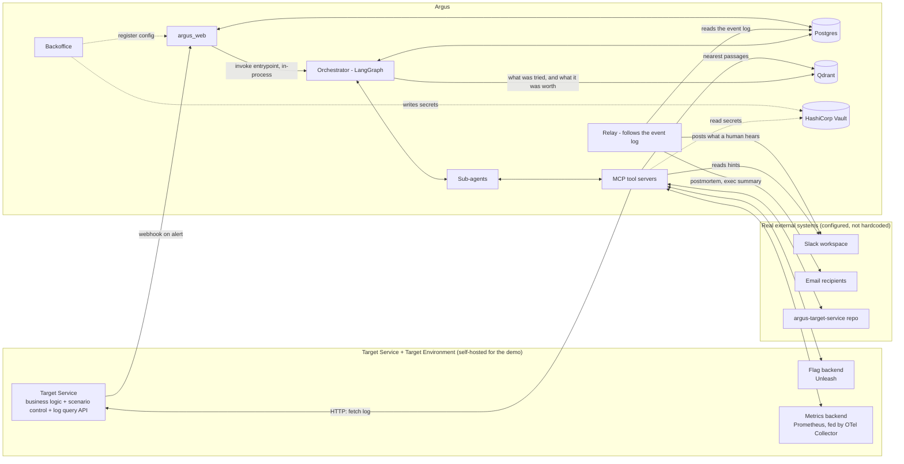
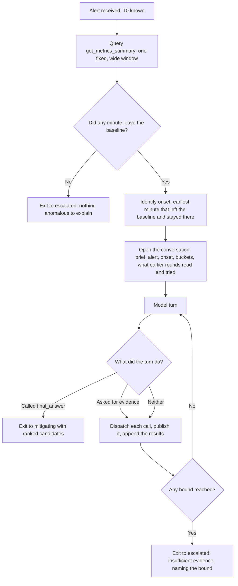
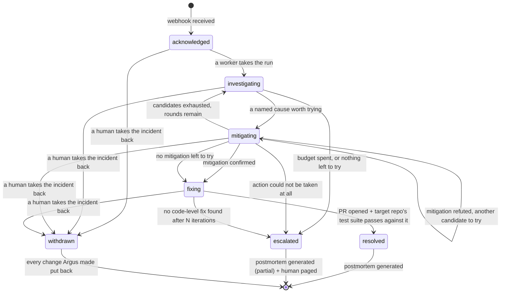
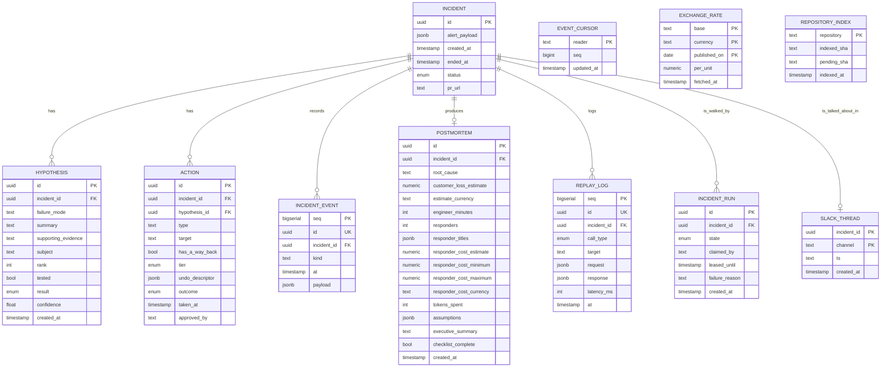
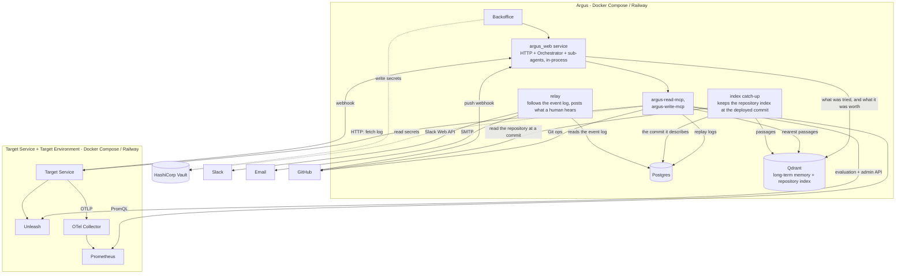

# Argus - Autonomous Incident Response Agent
### Project Spec & Architecture (v1)

> Unified spec: product requirements and technical design in one doc. All `§N` refer to sections of this document.

---

## 1. Problem Statement

Production systems generate more alerts than humans can triage. Today an on-call engineer reads the alert, correlates it with recent changes (deploys, flags, config), forms a hypothesis, mitigates, finds root cause, fixes it, and documents it - slow and inconsistent across engineers.

**Argus** receives an alert via webhook and runs this workflow autonomously: investigate, mitigate what it is pre-authorised to mitigate, propose a code fix, report status live (Slack/email), and produce a postmortem once resolved - escalating to a human whenever it isn't confident enough to act.

Argus is not "a chatbot with tools": it reasons under uncertainty, takes real actions against production, tracks its own hypothesis history to avoid repeating failed attempts, and knows when to stop and hand off.

## 2. Scope

Argus runs against a self-contained **Target Service and Target Environment** that we build and control (§15), not real production. This is deliberate:

- Safe to demo - no real rollback/deploy risk.
- Evaluable - we control ground truth (§21).
- Realistic in interface - exposes the same *kind* of APIs real infra would (metrics query, log fetch, feature-flag service, deploy/CI, a git repo for branches/PRs); swapping in real infra later wouldn't change Argus's code (§12).

**In scope:**
- Webhook ingestion of an alert
- Log/metrics querying and correlation with recent changes
- Root-cause hypothesis generation and testing (ReAct loop)
- Generic mitigation (flag toggle, service restart, configuration rollback)
- Code-level root cause search + PR generation (agentic search over the Target Service codebase, behind a seam that also admits RAG)
- Slack integration: reading hints, and reporting an incident as it happens - a thread per incident in a war-room channel
- Persistent memory: per-incident state + cross-incident knowledge base
- Postmortem + executive summary generation (with cost estimation)
- Escalation to a human on low confidence or exhausted actions
- An incident view to watch a live incident and browse the history

**Out of scope:**
- Real production infrastructure integration
- Fully autonomous PR merging (always needs human approval, §13)
- Guaranteeing root-cause correctness (accuracy is rigorously evaluated; perfection isn't guaranteed)

## 3. Goals & Success Criteria

| Goal | Success criterion |
|---|---|
| Detect & triage fast | Median time-to-first-hypothesis < 60s (Target Environment) |
| Correct mitigation | ≥ 80% correct mitigation on single-cause benchmark scenarios |
| Root cause accuracy | ≥ 70% correct root cause across benchmark suite |
| Safe autonomy | 0 actions outside the declared set of generic mitigations without human approval, across all test runs |
| Useful documentation | Postmortem has timeline, root cause, actions taken, what the incident cost the business as a stated estimate, and what it cost in engineer minutes and tokens as measurements, for 100% of resolved incidents |
| Know its limits | Escalates (rather than loops or guesses) on scenarios designed to be unsolvable |

## 4. Design Principles

1. **State lives in structured data, not an LLM's context.** Incident state, hypotheses, and actions are DB rows, never a reconstructed chat log. Agents read this state and propose changes; the Orchestrator is the sole writer (§7.1).
2. **Every mutating action is tiered before it's taken.** The tier (read-only / generic mitigation / outside the declared set / escalate) is checked by the Orchestrator before dispatch - never left to agent convention. What admits an action is membership of a declared set, not whether it can be undone (§13).
3. **Agents are stateless function callers**: a prompt + scoped tools + an LLM call, invoked by the Orchestrator with the relevant incident-state slice. No agent holds its own memory.
4. **Every external integration is a port with a swappable adapter.** Where a standard exists, the adapter implements it; otherwise Argus defines its own minimal interface and ships one adapter for the demo.
5. **Tests are a human-owned contract; code is what AI coding agents write against it.** This boundary is enforced structurally, not by convention.
6. **Everything is replayable.** Every external call (LLM, tool, MCP) is logged to `REPLAY_LOG` (§11.1) with enough detail to replay deterministically, so benchmark runs don't re-spend tokens or re-hit real systems.
7. **HTTP is a boundary concern, not a domain concern.** All external HTTP (webhook, incident view, config API) is owned by one module, the Web Application (§7.9). Every other module - including the Orchestrator - is reached only as an in-process call.
8. **What Argus did is recorded as it happens.** Components publish typed incident events as they work - an agent invoked, a retrieval requested and what it returned, an onset detected, a hypothesis formed, an action taken, a status changed - and one subscriber persists them per incident, in order (§11.1), leaving the single-writer rule (§7.1) intact. A publisher is one injected collaborator, publishing cannot fail the work it describes, and every reader of what an incident did (§7.7) reads that stream rather than re-deriving the story from its conclusions.

## 5. Terminology

- **Argus** - the system itself: the Web Application (`argus_web`, its only HTTP surface, §7.9), the Orchestrator, sub-agents, the incident view `argus_web` serves, the Backoffice, and the tool servers connecting them to the outside world.
- **Target Service** - the app Argus watches: a real, small, runnable app in its own repo (`argus-target-service`), with real feature-flag checkpoints and a real test suite.
- **Target Environment** - everything the Target Service is wired to for a given deployment: flag backend, metrics backend, deployed-commit state. Self-hosted instances for the demo; nothing about Argus changes if these are swapped for real infra later (§12).
- **Scenario control** - a Target Service module that seeds a known incident cause (or none) and reactively decides whether the anomaly is resolved, used by both a demo UI and the benchmark harness (§15.2).

There's no separate "Sandbox" - what might informally be called that is just the Target Service plus its Target Environment, above.

## 6. System Architecture Overview



**Backend:** `argus_web` as the single HTTP entrypoint (§7.9), the Orchestrator + sub-agents (in-process), Postgres for incident state, Qdrant for long-term memory (§11.2) and the repository index (§11.5), and the Target Environment (flags, metrics, logs).

**Frontend:** the incident view the Web Application serves (§7.7) plus a separate Backoffice admin surface (§7.8, §14) - neither reaches Postgres or Qdrant with SQL of its own.

## 7. Component Architecture

### 7.1 Orchestrator

A **LangGraph `StateGraph`** whose nodes are the sub-agents below; typed state (`IncidentState`, Pydantic) mirrors the Postgres schema (§11.1). Edges are conditional functions implementing the incident FSM (§10) - the graph defines legal transitions, the LLM picks among them. LangGraph's Postgres checkpointing gives incident-level durability for free: on restart it resumes from the last checkpoint.

No HTTP surface of its own. `argus_web` (§7.9) calls its intake in-process after validating the webhook, and that call creates the incident and queues its walk; the graph itself is invoked by a **worker process**, which takes queued runs one at a time. An investigation therefore outlives the request that announced it - it survives the caller hanging up, and it survives `argus_web` restarting - which is what makes the checkpointing above worth having: a run whose worker stopped is claimed by the next one and continues from the state already recorded, rather than beginning again.

A run is claimed with a lease. One worker walks a given incident, a second finds nothing to take, and a run whose holder stopped renewing becomes claimable again. A walk that fails is recorded against its run with the reason, so an incident nobody is working on is distinguishable from one still being investigated.

Responsibilities:
- Create the `Incident` row and queue its run, called by `argus_web`.
- Walk a claimed run's graph, in the worker, and record how the run ended.
- Run the tier-gate node (§13) before any mutating tool call reaches an MCP server.
- Own the escalation decision (the round budget, and whether the investigation named anything left to try).
- Fix the order candidates are tried in, from what long-term memory says was tried on incidents like this one (§11.2).
- Sole writer of all incident-domain Postgres state (`Incident.status`, `HYPOTHESIS`, `ACTION`, §11.1) - agents propose changes, the Orchestrator persists them, pairing every state mutation with the `INCIDENT_EVENT` that accounts for it, written on the same connection (§10, §11.1).

### 7.2 Investigator agent

Runs the ReAct loop (§9, §8). Tools: metrics read, log read, and flag evaluation - all from `argus-read-mcp` (§12.1). Long-term memory is not among them: what it holds is what was *done* about earlier incidents, which is not a hypothesis and which this agent could not act on (§11.2). Nothing from `argus-write-mcp` is bound to this node. Hints reach it as published `INCIDENT_EVENT` rows (§11.1), written by the Orchestrator from hints the Communicator (§7.5) surfaces - not via direct Slack access.

### 7.3 Mitigation agent

Takes a confirmed/high-confidence hypothesis and proposes a generic mitigation: revert a flag, restart a service, or return an application to the configuration revision it ran before - all from `argus-write-mcp` (§12.1). Which mitigation answers which cause is a fact about Argus rather than a judgement made per incident, so it is a lookup from the named failure mode and nothing else; whether Argus may then take it unasked is a different question, asked of the declared set by the Orchestrator's gate node (§13). Afterward it re-queries the same metrics/logs and returns a `confirmed`/`refuted` verdict; the Orchestrator writes the resulting `ACTION.outcome` and `HYPOTHESIS` update (§7.1).

*Which* mitigation comes from the cause; *what it acts on* comes from the evidence that names a thing rather than describes one. A flag revert is addressed to the flag the provider recorded changing, confirmed against the candidate that blamed it; a restart is addressed to the service the alert is about; a configuration rollback is addressed to the application, and to nothing finer - which revision it returns to is the platform's to resolve, because nothing above that port holds a deployment history to choose from and a commit found in a diff is not necessarily a revision the application ever ran. None is read from the candidate's `subject`, which is the model's prose about the symptom - "io-shop process heap (memory_used_bytes / heap of 2048MiB limit)" is a real one - and describes a fault rather than naming anything a platform can be asked to act on.

The cause is chosen from a closed set, and the set reaches the model with each mode's meaning attached rather than as a list of names. The two that dispatch differently are the two most easily confused: a deployment that shipped bad code is answered by rolling the code back, and a deployment that shipped a bad configuration value is answered by returning the application to a configuration revision that already ran. Handed only the names, a model that has just seen a deploy land at the onset reads a configuration change as a bad deployment - which is not unreasonable, and is not the mitigation the incident needs.

An action carries an undo descriptor when it leaves something behind for somebody to put back, and carries none when it does not. A flag Argus moved is a flag somebody has to be able to move back; a restart changes no persistent state, so there is no prior value to record and nothing a withdrawal could act on. A configuration rollback records *two* things, because the platform refuses one while it reconciles the application itself: the entry that was running, and whether that reconciliation was on. Suspending it is part of performing the rollback rather than a separate concern, and an undo that restored only the revision would leave a deployment that looks correct from every angle a reader has while silently receiving nothing anybody ships to it. The descriptor is how a refuted mitigation is put back - never what admits one.

Verifying a mitigation takes two steps, and they answer different questions. First, did it land: the write tier waits for the change to become visible - a flag to evaluate to what was written, a service's process start time to move - and raises rather than reporting an unlanded change as made. Only then, did it help: the service is re-read until a minute that began *after* the action can be judged. Collapsing the two would make "it did not happen" and "it happened and did not help" the same observation, and a leak still climbing would read as evidence that restarting a leaking service does not work.

Putting a change back is conditional, and the condition is a question about the provider's record rather than about the world's current state: *has anybody but Argus changed this flag since Argus wrote it*. The undo descriptor carries the moment the provider recorded the write - the provider's own clock, taken from the response to it - and the flag's change history is read from that moment forward, with Argus's own changes discounted by the actor the provider attributes them to. Anything left is somebody's deliberate decision, so the flag is left as found and the incident records that it was.

The obvious check - read the flag and see whether it still holds what Argus wrote - is the wrong one twice over. A provider serves current state from an evaluation cache it refreshes on its own schedule, so a change made moments ago reads as no change at all, and the window in which that is true is exactly the window in which somebody is reacting to the incident. And a flag switched away and switched back reads as untouched, when what it means is that somebody has been in there. Three answers come out of the check, never two: restored, left as found, or - where the history cannot be read, or the change predates the descriptor carrying its moment - not established, which writes nothing and says so.

### 7.4 Code-Fix agent

Invoked when mitigation fails, and again when one succeeds - a reverted flag buys time without ending a cause. Searches the Target Service repo to localize the bug, drafts a patch **plus the test that exposes it**, opens a branch + draft PR via `argus-write-mcp`'s `open_pull_request`.

Localizing is **agentic search**: the agent searches and reads the repository as tools across turns, following the code the way a person does - a name in the log leads to a file, that file to the function it calls. It starts from the whole hypothesis rather than its summary, because the evidence is where a location lives: the Target Service's error boundary records the innermost frame, so one of the log lines the investigation quoted names the file and the line the fault was raised on.

There are two ways to find code and the agent is offered both: **substring search** over the repository at the deployed commit, and **retrieval by meaning** over an index of it (§11.5). Neither is a fallback for the other. A cause that has a name - an exception class, a function, a flag key - is found faster by searching for the name; a cause that has only a description is found at all by searching for the description. Which one to use is a question about the hypothesis in hand, so the model chooses per call rather than a threshold choosing for it.

`CODE_SEARCH` decides which exist, and it switches a whole mechanism rather than a tool list: set to `grep` the read tier registers no retrieval-by-meaning tool and opens no store, the catch-up loop (§11.5) builds nothing, and the push webhook records nothing - a deployment that will not search by meaning does none of that work. `both` is what a deployment runs. The single channels exist so the benchmark can run each alone over the same incidents (§21), which is the only way to compare two retrievers.

The index describes one commit, and that commit may be older than the one being fixed. Every answer it gives says so when it is behind, and the agent can ask how fresh the index is before it starts reading, rather than learning it from a result it has already acted on. It writes tests freely and no path is withheld from it: the test that fails before the fix and passes after is the most valuable half of the proposal, and a repo with a file the agent may not touch is one where the fix cannot carry its own evidence. Its loop is bounded on the same three axes as the investigation's (§9) and for the same reasons, and it is the agent that shows why one axis will not do: it reads whole files and carries every one it has read for the rest of the run, so it can be frugal in calls and ruinous in tokens. Its answers are whole files too, which is why its output ceiling is the model's own rather than the modest one a short verdict needs - past the point where a single response can be asked for in one piece, so the answer is streamed. Its binding has **no `merge_pull_request` function at all** (tier enforcement by absence) - what keeps a bad patch out of service is that a person merges it.

### 7.5 Communicator agent

Nothing in the walk tells anybody anything. Every agent publishes what it does as it does it (§10, §11.1), and the Communicator follows that record: a relay reads the events in the order they were published, decides which of them a human hears, and says them where that human is. A step is reported because it happened rather than because whoever handled it remembered to report it, and an agent added later is heard from on the day it publishes its first event.

The event log is a transactional outbox. Every event is written on the connection its decision is written on, inside a savepoint, so an event exists exactly when the thing it describes does - and the relay is the polling publisher over it, keeping a durable cursor of its own. Delivery is at-least-once: the cursor moves only past a line that landed, so a relay restarted mid-incident repeats at most one message and loses none. It runs as its own process, because a worker walking an incident is busy for minutes at a time and a relay sharing that process would go quiet exactly while an incident was most worth hearing about.

Which lines reach a person is a policy over event kinds, stated in registers a destination translates rather than in any destination's own vocabulary. What Argus found, changed and concluded is *followed* - it reaches whoever chose to follow that incident. How an incident opened and how it ended is *announced*, addressed to everyone including the people who never opened it. The write-up it leaves behind is *filed*, where write-ups are kept. The reading it did to get there is unsaid: forty log lines read is a fact about method, and a channel carrying it would bury the four lines that matter. Slack reads those as a channel message, a reply in the incident's own thread, and a message in the postmortem channel; email reads the same three as a send, a digest and an attachment. An incident's thread is whatever Slack called its first message, remembered against the incident so that a conversation can be found again twenty minutes later by another process.

Slack refusing is an ordinary outcome of talking to Slack rather than an error in the walk, and no refusal can fail an incident. A throttle or a workspace that did not answer says nothing about the message, so the line keeps its place and is said on a later pass. Any other refusal - a renamed channel, a revoked token - will say the same thing on every pass, so the line is recorded on the incident's own timeline as one that never arrived, and passed over: a relay waiting for a channel to come back would go silent about everything behind it.

Reading is the other direction, and stays in the read tier: the Communicator is the only agent that reads Slack for human hints (via `argus-read-mcp`), converting one into a structured hint returned to the Orchestrator, which publishes it as an `INCIDENT_EVENT` (§7.1).

### 7.6 Postmortem agent

Triggered once on transition into `resolved` or `escalated`. Consumes the full incident timeline and produces the postmortem: timeline, root cause, actions taken, what it cost - two estimates with their assumptions and two measurements (§21.3) - and an executive summary.

LLM-backed rather than agentic: it retrieves nothing and drives no tool loop, because everything it writes about has already happened and is already recorded. Every figure it publishes is computed from that record, and the model supplies none of them - it writes prose. What a figure rests on, the document states beside it: the windows compared, the exchange rate applied and its date, a currency left out of a total, the working year an annual pay band was divided by, and the band each responder's title was priced at.

It answers by calling `submit_postmortem`, never in prose, so a document is a structured answer or no answer at all. The submission is checked before it is accepted, and a currency amount in the executive summary that is not Argus's own figure is a fault of exactly the kind a missing field is: a number the reader would act on that nothing computed. A rejected submission is refused through that call's own tool result, so the model repairs the document it wrote instead of writing a second one from nothing; a model that made no call has nothing to attach a refusal to and is asked again. Two attempts, never three - it must terminate even on partial success, and hands off what it has with the missing fields flagged.

A source that cannot be read leaves its figure absent and says why. Never zero: a zero is a claim that nothing was lost, and the difference between "nothing" and "unknown" is the whole value of the number. An incident nobody acknowledged is the other side of that distinction - a source that answered, measuring a response that did not happen - and is reported as no engagement rather than as an absence.

It writes nothing to long-term memory. What is remembered of an incident is what was tried and what each attempt reached (§11.2), composed from the incident's own action rows by a step of its own - and a document a person opens is a different job, from a different source, for a different reader. A postmortem that failed to be written would otherwise be a memory that was never filed.

### 7.6a Remembering what was tried

The last thing a walk does before the write-up, and a step rather than an agent: no model, no retrieval, no judgement. It reads the incident's actions, keeps the ones that reached a verdict on an action it can identify - a subject the row named, and a kind this version still has words for - and files them where the next incident that looks like this one will find them (§11.2).

Before the postmortem rather than after it, so neither failure can take the other down. This step swallows its own - the incident is over, nothing downstream reads what it produces, and a store that is unreachable must not be the reason an incident ends without its write-up - and a postmortem that raises cannot then cost the next incident what this one learned. A failure here is said on the timeline, because silence is indistinguishable from an incident that had nothing worth filing.

### 7.7 Incident view

Argus's own screen - what it is doing, as it does it. Served by the Web Application itself (§7.9) as server-rendered Jinja2/HTMX pages with no separate frontend build, so there is one process to start and one HTTP surface to reason about. The Target Service has an operator console of its own showing the incident from outside; this shows it from inside, and the two are meant to be watched side by side.

The front page is the incident that is happening now: the newest one that has not finished, or, when nothing is running, the newest there is, shown as finished. That rule needs no "current incident" state to keep correct, and a resolved incident stays on screen at the moment everyone is looking at it. With no incident at all the page says so and waits.

A header names the alert, the service, the status and how long the incident has been going; the status is visibly live while it runs and still once it ends, so a glance answers "is this still happening" without reading a word. Below it, the incident's recorded events (§11.1, §4 principle 8) are narrated in the order they were published, each line naming who did it - Argus itself, the Investigator, the Mitigation agent - because "what did Argus do" is really "which of its agents did what". The narration is a rendering of the stream and nothing more: it never groups two events into a conclusion, drops one it finds uninteresting, or restates a hypothesis in its own words.

The evidence rides on the events that read it and is gathered into one table per channel below the narration - metrics, flag history, production changes, log lines - each row said once. An investigation that widens re-reads overlapping windows, so evidence rendered under each retrieval would show the same minute several times over. The narration links into those tables wherever a line names one row: the onset to its minute, an action to the flag change it reverted, a cited finding to the minute it names and that minute's log lines. Prose is never matched to a particular log line, because a link built by guessing which line was meant points confidently at the wrong evidence, which is worse than no link at all. Model prose is repaired for presentation only - escape sequences resolved, flag states said the way the rest of the page says them, times rendered as clock times - and never edited in what it claims.

The page polls at the cadence the Target Service's own console uses, so the two screens move together. Each fragment carries a version of what it says and an identical reply is not applied at all: almost every poll returns exactly what is on screen, and re-rendering it anyway would send a table being read back to its first row and scroll away a row somebody followed a link to. The elapsed time is counted in the browser from the incident's own start and end, so time passing is not itself a change.

An incident's own page renders its whole walk: its alert, its status, and every candidate the Investigator ranked, in rank order, with the evidence each was formed from shown against the claim that cited it rather than as a collection beside it. A candidate the walk never reached is shown as untried rather than omitted - the difference between an investigation that was confident and right and one that ran out of options is most of what a walk has to say. Each tried candidate carries the action taken for it, named by `ACTION.hypothesis_id` (§11.1), the verdict recorded when that action was taken, and whether the change was put back. An action with no verdict yet is displayed as undecided, because a live incident is partly unfinished by definition.

A history view lists past incidents newest first, reached by navigation from every page rather than by knowing a URL, and a postmortem is its own page - it is the largest body Argus writes, and the incident page beside it polls.

The view holds no incident-domain logic: it decides how something is displayed, never what it means. It reads through the repositories that own the incident tables and writes no SQL of its own, and it exposes nothing that can change an incident - reading what Argus did must not be able to alter it.

### 7.8 Backoffice

A minimal admin UI, its own module, for editing `INTEGRATION_CONFIG` (§11.3): Slack workspace/channel routing, postmortem/exec-summary recipients, and the adapter configs (git, flags, metrics, logs) - per deployment environment. Each adapter config renders as a structured form matching that adapter's schema, not raw JSON. Secrets referenced here are never stored here (§14).

### 7.9 Web Application (`argus_web`)

The single HTTP-facing surface for Argus. No other module listens on a network port or parses HTTP; everything past its boundary is a plain function call.

Exposes four endpoint groups:
- **Alert webhook** - receives an alert POST, validates it, normalizes it into Argus's own `Alert` domain object, then calls the Orchestrator's intake in-process with that object - never the raw payload (§25). It answers as soon as the incident exists, with the incident's id: the investigation is queued for a worker (§7.1) rather than run here, so a caller is never held open for the length of one, and `argus_web` cannot reach the graph at all.
- **Incident view** - the pages of §7.7: the live page and the fragment it polls, the incident history, one incident's walk, and the postmortems, read through the repositories that own the incident tables (§11.1). Those pages are the only reader there is, so no JSON API sits beneath them.
- **Configuration API** - serves the Backoffice: CRUD over `INTEGRATION_CONFIG` (§11.3).
- **Push webhook** - receives GitHub's notification that the Target Service's repository has moved, verifies the signature over the bytes that arrived before parsing any of them, and writes down the commit the deployed branch now points at (§11.5). Nothing is indexed here: this process serves HTML without installing an embedding model, for the same reason the alert webhook does not walk an incident.

`argus_web` holds no incident-domain logic - only request validation and response shaping. It calls the Orchestrator's intake as an in-process dependency and reads/writes Postgres using schemas defined in `argus_core` (§20.2).

Normalizing the incoming alert is a boundary/controller responsibility, not domain logic: `argus_web` is the only place a vendor-specific payload shape may appear, and it never crosses into the Orchestrator or beyond. This is deliberately not the ports-and-adapters pattern (§12) - alert sources are inbound and open-ended, not a small set Argus chooses - see §25 for the intended mechanism.

## 8. Agentic Workflow Design

Several patterns, applied to different sub-problems:

- **ReAct** - the Investigator's core loop: observe (query logs/metrics/diff) → reason (form hypothesis) → act (query more, or hand off to Mitigation) → observe result. Detailed in §9.
- **Agentic search** - how Code-Fix (§7.4) localizes a bug: the model searches and reads the repository as tools across turns, following the code rather than matching a query against it. What it is handed to start from is the whole hypothesis, evidence included - the service's error boundary records the innermost frame, so a log line among that evidence names the file and the line.
- **RAG** - retrieval by embedding similarity. Two uses, over two different corpora: (1) Code-Fix (§7.4) searches an index of the Target Service's own source (§11.5) for the code a fault is *described* by, alongside the substring search that finds the code a fault is *named* in - the model picks per question, and which retriever wins on which repository is a benchmark dimension (§21) rather than an assertion here; (2) the walk retrieves similar past incidents from long-term memory (§11.2) before it proposes an action, and demotes any candidate whose answering action was tried on one of them and refuted - a fact about what was *done*, which the incident's own evidence can never supply.
- **Multi-agent orchestration** - the Orchestrator (§7.1) delegates to specialized agents (Investigator, Mitigation, Code-Fix, Postmortem), each with a narrow tool set and prompt, coordinated through shared incident state (§11.1). The Communicator (§7.5) is coordinated through that same state without being delegated to at all: it follows what the others published rather than waiting to be called, which is what keeps an incident reported even when the walk is too busy to say so.
- **Self-critique / reflection** - before any mitigation or escalation, the agent scores its own confidence against a threshold (§10); after a mitigation, it re-observes state and judges whether its hypothesis was confirmed or refuted (§7.3).

## 9. The Investigation Loop

The `investigating` phase (§10) looks like one node from outside, but runs a ReAct loop: a conversation the model drives and the loop bounds, with a fixed opening.



Step B seeds the *first* hypothesis before any log is read - "last 3 times we saw this pattern, it was a bad deploy." Steps C-E are fixed because the onset is a **measurement, not a decision**: it anchors every window the model can ask for and every later comparison between runs, and a sampled call that locates it differently on a second run makes two investigations of one incident incomparable and the eval suite a measurement of noise. The model is not denied the metrics - it may read them again itself - but it cannot skip the first read or contest what it found. A window in which no minute departs from the baseline has no onset to anchor on and nothing to explain, so the loop exits immediately without asking the model at all: there is nothing to ask about, and a model handed an alert with no anomaly will invent a cause for it.

From there **the model chooses**: which of the three channels (§16) to pull, over what window, in what order, and when it has seen enough. It is offered those three retrieval tools and a fourth, `final_answer`, whose input schema is the ranked-hypotheses shape. Calling it is the only typed exit, which keeps the seam impossible to satisfy without producing a verdict, and makes "the model stopped asking and wrote prose" a detectable outcome rather than something to be parsed hopefully - a text-only turn is told it answered nothing and gets another turn if the budget allows one. A call the loop cannot serve - an unknown tool name, an inverted window, a window already read - comes back as a failed tool result the model can correct on its next turn, never as an exception that kills an investigation that has already paid for everything before it.

Termination is the loop's, in **three independent bounds**: tool calls, cumulative tokens, and wall-clock seconds. They fail differently and none implies the others - a model reading three-hour windows is cheap in calls and ruinous in tokens, one looping on a narrow window is the reverse, and one frugal in both can still leave a human waiting past the point the answer was worth having. Bounding only the calls, the tempting single knob, bounds the least expensive of the three. Each is checked between turns and none is expressed to the model, because a bound it could ask to extend is not a bound. When the tool-call bound is one turn from binding the model is told so on the tool result it is already reading, so it can spend that turn answering from what it has instead of asking for evidence it will never be shown; that is a hint, and the loop cuts at the bound whatever the model does with it.

A model that reads what it has already read learns nothing and pays a turn for it, so **a window served once is refused the second time** rather than fetched again, with the refusal saying so. The metrics the loop read itself count as read, since those minutes are in the opening message. What was read is also what the investigation reports alongside its candidates, so a later round - bought by a refutation, not by a wider window - is told what the round before it saw, and so that a channel nobody asked for stays distinguishable from one that was asked and came back empty.

**The onset is sometimes only a lower bound**, and the model is told when it is. The check is structural rather than introspective: if the earliest bucket in the metrics window is already anomalous, the incident began before the window did, so the onset located there is a floor and a window anchored on it may not contain the cause. Read literally, that condition says there is no calm stretch on screen to serve as a baseline - which is the same thing. It matters because the failure it guards against is undetectable from the model's own report: one that formed a plausible hypothesis from too little evidence reports high confidence, because it cannot miss what it was never shown. Stating the lower bound as a fact in the opening message is what lets the model know to reach further back; no confidence threshold could tell it.

The change-event channel (§16) attacks the same problem from the other side: deploys and configuration changes are read as structured rows over a span far wider than any log window, rather than hoped for inside one. A change is a candidate to judge against the symptoms, never proof, and the channel is legitimately silent about causes it does not cover - a flag toggle is diagnosed from log prose, which is why reaching further back in the *logs* is what ties a candidate change to the symptoms. Spending the whole budget on one channel is permitted: requiring a spread would be re-imposing a fixed sequence under another name, and the incident that changes alone explain is exactly the case this loop exists to allow.

"Anomalous" throughout means *relative to the service's own calm baseline in the same window* (§16), never a fixed error rate or latency. A service that normally sits at 8% errors is not permanently on fire, and one that normally sits at 0.5% should not have to reach 10% before Argus notices. An absolute threshold would also duplicate - and eventually contradict - the threshold the operator already configured in their own alerting tool, which is what fired the alert in the first place.

Exhaustion is a real outcome, not a formality. When a bound binds before `final_answer` is called, the loop exits to `escalated` carrying "insufficient evidence" - one candidate with no cause and no confidence, never a hypothesis manufactured to fill the field - and the summary **names every bound that ran out**. "I ran out of time" and "I read everything I was allowed to and still could not tell" are different accounts of the same escalation and call for different things from the human who picks it up, and which one they hear must not depend on the order the checks happen to be written in.

The price of the model driving retrieval is that non-determinism moves into the control flow, not just the answer: two runs of the same incident can read different evidence, so a bug can reproduce intermittently. The transcript is the mitigation, which is why every retrieval and its result is published as it happens (§4 principle 6, §11.1) rather than reconstructed afterwards.

## 10. Incident State Machine



**A mitigation that worked does not end the incident.** `fixing` is reached by two roads, and a confirmed mitigation is one of them: the symptom is gone and the fault that caused it is still in the code, with a flag holding it off or a fresh process yet to fill up. Calling that resolved would file a postmortem about an incident that is still waiting to happen - and for a leak it is not even a pause, only the length of time the new process takes to climb back. Only a fix reaches `resolved`. The other road to `fixing` is Argus running out of mitigations it may take, and the two are worth telling apart in the record even though they arrive at the same node.

What admits the walk is a *named* cause, not a confident one: a generic mitigation taken alone, confirmed against the service and put back where there is anything to put back costs two minutes, and the ambiguous incident is exactly the one the walk exists for. An investigation that named nothing, or whose every candidate the walk has already disproved, escalates instead - and so does one whose cause is named exactly and answered by nothing in the declared set, which is a different thing and is refused in different words: a cause nobody could act on is a gap in the evidence, where a kind of failure no mitigation reaches is a decision. An upstream dependency's outage is the second, and the distinction is what a human picking the incident up acts on. Escalation from `investigating` is the budget (§9) binding first; from `mitigating` it is the round budget. All of these are named, environment-driven config - the first values to tune against benchmark results (§21).

`acknowledged` is where an incident sits between being accepted and being picked up: Argus has the alert and has committed to handling it, and the walk is queued for a worker (§7.1). It is a status rather than an event because it is the incident's own state and can last - a worker that is down leaves incidents there, and a screen reporting them as `investigating` would claim attention nobody is paying. The interval between it and `investigating` is how long the incident waited for a worker, which is the one duration the timeline could not otherwise report.

`mitigating` is re-enterable: a refuted action self-loops on it for the next candidate, because an action that was taken and did not help leaves the incident in the same phase it was already in. `fixing` and `escalated` are not interchangeable - `fixing` says Code-Fix is looking for a permanent fix and Argus is still working; `escalated` says Argus is out of moves and a human owns it. `escalated`, `resolved` and `withdrawn` are terminal.

`withdrawn` is the one status Argus does not decide. It is reachable from every phase the walk passes through, because the moment somebody wants the incident back is not one Argus gets to choose, and it is the only transition written with `Actor.HUMAN` - the single row about something Argus did not do. `status_after` never returns it for that reason: it is set from outside the walk, and the walk finds out by reading the incident back rather than by being told.

Marking and stopping are separate, and the separation is what keeps one writer on an incident (§7.1). The endpoint that accepts the withdrawal only writes the status; the walk asks before each node whether the incident is still wanted, stops where it is not, and puts back what it changed itself. Asked *before* a node rather than after, since a node that has already toggled a flag cannot be stopped by anything done with its return value - and asked again inside Mitigation's wait for a service to recover, which is the one place a walk sits still long enough for the question to matter.

Putting the changes back is conditional, never a blind restore: a flag is returned to the state Argus found it in only where nobody but Argus has changed it since Argus wrote (§7.3). A flag somebody else has touched is theirs, and the incident records that it was left as found. The unwind is idempotent for a different reason than the check: a second pass sees only Argus's own restore in the record, so it restores again, to the state the flag is already in. It means the world a withdrawal hands over is the one Argus was given, not a half-mitigated state nobody chose.

Withdrawal is not a verdict. No postmortem is written for it: there was a response, it was stopped part-way, and a document summarising what Argus concluded would be summarising a conclusion that was never reached.

Every transition is published as a paired `StatusChanged` event, written on the same connection as the status itself, per the Orchestrator's single-writer rule (§7.1, §11.1). A status is written only when the incident enters it: the account is read as where the incident has been, so a status set and overwritten by the next node is never recorded at all.

Work that settles nothing and moves no status is published by the node that did it, as the event that says what it was - an action refused at the tier gate, a walk moving on to the next candidate, a change put back by a withdrawal. There is one account of an incident and every line of it is a published event; nothing writes a second, column-shaped copy alongside.

## 11. Memory & Data Architecture

Argus needs two kinds of memory, backed by two different stores (§11.4): **episodic (per-incident) memory**, which stops the agent taking again an action it has already taken and ruled out, and **long-term (cross-incident) memory**, which tells a new incident what was tried on the ones that looked like it, and what each attempt turned out to be worth.

A third store holds no memory at all. The **repository index** (§11.5) describes the Target Service's source as it stands, so a fault can be found by what it does rather than by what it is called. It is derived state - deletable, rebuildable from the repository at any time - which is what separates it from the two above, and why it lives beside them rather than among them.

### 11.1 Episodic / operational state (Postgres)

Structured state, not free-text - every graph node reads/writes this, never a reconstructed chat log:



Separate tables rather than one JSON blob per incident, because the eval metrics (§21) - wasted actions per incident, escalation precision/recall, root-cause accuracy - are counts, joins, and group-bys over structured fields (`tested`, `result`, `confidence`, `tier`). A relational schema already has that structure; free text or a blob would mean re-deriving it at query time.

Neither `HYPOTHESIS` nor `ACTION` has row history - both are mutated in place (`HYPOTHESIS.tested`/`.result`/`.confidence` as the ReAct loop refines, §9 step F; `ACTION.outcome` once a mitigation is confirmed/refuted, §7.3), written in the same transaction as the paired `INCIDENT_EVENT` that accounts for the change (single-writer rule, §7.1). Without that pairing, the walk the incident view renders (§7.7) and the incident narrative the Postmortem agent consumes (§7.6) would collapse to only their last value - and both read the same events through the same renderer, so the page and the document tell one story rather than two.

An `ACTION` row is written *before* its action is taken, and one incident has at most one action per candidate - a unique constraint on `(incident_id, hypothesis_id)`. The insert is therefore the claim on the right to act: a walk resumed inside the mitigation node (§7.1) is refused it by the database rather than by a check it could race with, and answers with the outcome the earlier attempt recorded. Where that attempt recorded none - it stopped between acting and saying what happened - the flag provider's own event log is asked whether the change landed, since it is the only record of what a process that no longer exists managed to do; the incident escalates if it did, or if the provider cannot say.

`INCIDENT_RUN` is the queue between the two processes: `argus_web` writes a row when it accepts an alert, and a worker claims it to walk the graph (§7.1). It is beside `INCIDENT` rather than inside it because an incident's status says what Argus knows about the failure while a run's state says whether anything is currently thinking about it - folding the two together would make "nobody is walking this" and "this is resolved" the same column. `claimed_by` and `leased_until` are what distinguish a worker still walking a run from one that stopped: a lock cannot, since a dead worker's lock dies with its connection.

`INCIDENT_EVENT` is the account of the work rather than a record of its conclusions (§4 principle 8): one append-only row per thing that happened, in the order it was published, carrying the whole payload it is about - every bucket a metrics read returned, every log line, every recorded flag change. The payload is stored rather than a reference to fetch again, because the log store moves on and a page that re-fetched would show something Argus never saw. `kind` names the event and `payload` is that event's own shape, so a new kind costs a model rather than a migration; `seq` orders two events that share a timestamp. Rows are appended by the single subscriber that listens to the publishers (§4 principle 8) and are never updated, which is what leaves the single-writer rule intact - the four domain tables keep the Orchestrator as their one writer, and this table has one of its own.

`SLACK_THREAD` and `EVENT_CURSOR` belong to the Communicator (§7.5) rather than to the incident record, because their invariants are its own: where an incident's conversation is, and how far the relay has read. Keeping the correlation in a table of its own is what lets `INCIDENT` stay ignorant that Slack exists - a second destination adds a row rather than a column, and a deployment with no workspace configured writes neither table. The module that owns a table is the module whose rules it holds.

`EXCHANGE_RATE` belongs to no incident, and is the only table here that does not - which is why it hangs off nothing in the diagram. It is a cache of what a currency was worth on a day, read when an incident's loss is reported in a currency the takings were not measured in. Keyed by the day rather than the moment: a published rate is a fact about a date, so two incidents on the same day are priced identically however far apart they ran, and a rate already fetched is never fetched twice. `fetched_at` records when Argus asked, which is a different question from when the rate was published and the one to ask when a figure looks stale.

`REPOSITORY_INDEX` belongs to no incident either, and belongs to the index rather than to the record: it is the watermark saying which commit the stored passages describe and which commit the repository is at (§11.5). It is in Postgres because "is what I searched what is running" is an exact comparison rather than a nearness, which is the one question a vector store answers badly. It is also the only part of the index that is not derived - the passages can be rebuilt from the repository at any time, and this row is what says where they would be rebuilt to.

`REPLAY_LOG` serves a different purpose again: it's Argus's own eval infrastructure (Design Principle 6, §4), not incident-domain state, written at a different granularity - one row per LLM completion or MCP call. It's written inside the Orchestrator's process, from whichever agent node makes the call, via a shared instrumented client in `argus_core` - never by the MCP servers themselves, keeping them as pure as §13's MCP-server-boundary guardrail requires.

### 11.2 Long-term memory (Qdrant)

One collection, one record per finished incident:

```
{
  incident_id, embedding(described_as),
  service, alert_name,
  tried: [ { identity: { action_type, subject }, verdict }, ... ]
}
```

**What is stored is what was done, not what it was.** A cause is re-derivable: the metrics and the logs of the incident in front of you say what broke, and an investigation given long enough reaches it without help. What was *done* about it is not re-derivable at any budget - that Argus set a particular flag and the service did not recover exists nowhere except in the record of the incident that tried it. So the record carries every action Argus took and the verdict each one reached, and carries no opinion about the cause.

**An action is identified by its kind and its subject together, never by either alone.** The subject alone cannot tell a flag put back from a service restarted, and those are different evidence about the same cause; the kind alone says nothing about blast radius, since restarting one service is no licence to restart another. The pair is the unit the walk compares within an incident and the unit memory compares across them - one question, one type (§13).

Every incident that ends is recorded, not only a resolved one. An escalation after three refutations is the more informative of the two: it says three actions were taken and the service stayed broken, which is exactly what the ordering rule below consumes. An incident where no attempt reached a verdict on an action it can identify writes no record - its content would be empty.

The record is composed from the incident's own `ACTION` rows and the alert that opened it, by a step of the walk that does nothing else (§7.1). Not from the postmortem: that is a document for a person to read, written by a different step from a different source, and deriving one from the other would make an unwritten document into a missing memory.

`described_as` is the text that is embedded and searched. It is assembled rather than written - the alert's own words, then what the investigation concluded and the evidence it cited - so one vector carries both how the monitoring named the incident and what it actually looked like. Assembled rather than composed by a model because its only job is to be matched against, and a join of text already on hand embeds to very nearly the same place at no cost, with no failure mode, and reproducibly.

**Recall informs the order actions are tried in, not the hypotheses.** Before the first action of an incident is proposed, memory is searched with this incident's description, and each candidate is asked of Mitigation what action would answer it; any candidate whose action was taken on a similar past incident and refuted is demoted below the ones no record names. Asked of the action rather than of the candidate, because a candidate is prose: what a model calls a leak is worded differently every round, so a restart of the same service looked like two unrelated subjects until the comparison moved to what would be *done* about them. The Investigator is not seeded: what is stored is not a hypothesis, and a model told "this flag failed on a different incident" has nothing to do with it. The mitigation side, choosing what to change next, is the one place the fact changes a decision.

Demoted, never removed. A past incident is evidence about a past incident, the same flag can break the service twice, and a walk that refused to try the only candidate it had - on the strength of a different incident's result - would end in an escalation it had the means to avoid. The set of candidates tried is identical with memory and without it; only the order differs. Where memory changed an order, the timeline says so and names the record it was changed on the strength of.

The search narrows by `service` before it ranks by similarity - coarse filter, fine ranking - which matters on a small corpus where pure semantic search alone would be noisy. Whether two incidents happened to the same service is an exact question, and a description that merely mentions a service name is not an answer to it. It narrows by nothing else: matching on the alert's name would defeat the mechanism, since one cause raises differently-named alerts on different days and two alerts meaning the same thing are rarely spelled the same way.

A similarity floor and a result limit bound what one ordering decision reads (§14). The floor is the one that matters: a nearest-neighbour search always answers, so without it a corpus holding one unrelated incident hands it back as the nearest thing it has, and a candidate is demoted on the strength of it.

**Nothing depends on memory.** A store that is empty, unreachable, slow, or switched off is treated identically - as a store that returned nothing - and neither a failed search nor a failed write ever escalates an incident, ends a walk, or prevents an action. Every decision memory informs has an answer without it, and a system that stalled over a cache of old incidents would be worse than one with no memory at all. A failed write is said on the timeline, because silence there is indistinguishable from an incident that had nothing worth filing.

Memory can be switched off entirely, and with it off the system neither writes records nor consults them. That is a real configuration rather than a way of disabling something broken: §21's whole question is what memory is worth, and two runs that differ in exactly one thing are how that is asked.

Qdrant, in a collection of its own beside the repository index (§11.5) rather than a second vector store. The two corpora have nothing to do with each other - one is rewritten continuously as code moves, the other appended to once per incident - but at a few hundred records neither engine has a retrieval advantage worth measuring, and what remains is operational: one store to run, one client to learn, one service in the compose file.

### 11.3 Configuration (Postgres)

```
INTEGRATION_CONFIG {
    uuid id PK
    jsonb git_config           -- git tools: repo URL, branch, etc.
    jsonb flag_config          -- flag tools: adapter-specific (e.g. base URL)
    jsonb metrics_config       -- metrics tools: adapter-specific (e.g. base URL)
    jsonb log_config           -- log tools: adapter-specific (e.g. URL, shared path, or bucket/key)
    text slack_war_room_channel      -- where an incident is reported (§7.5)
    text slack_postmortem_channel    -- where its write-up is filed (§7.5)
    jsonb postmortem_recipients      -- array of email addresses
    jsonb exec_summary_recipients    -- array of email addresses
    jsonb vault_secret_paths         -- references only, never secret values; see §14
    timestamp created_at
    timestamp updated_at
    text updated_by
}
```

The four `*_config` blobs are opaque to `argus_web`/Backoffice - each is parsed only by its own MCP server, per its own small schema (Design Principle 4, §4). This is what lets a second adapter (e.g. logs via shared filesystem or S3 instead of HTTP) be added without a schema migration. Edited by humans through the Backoffice, via `argus_web`'s configuration API (§7.9); changes rarely, and no agent ever writes to it.

### 11.4 Why relational for operational state

Free text or embeddings-only would fight several requirements above:

1. The eval metrics (§21) are inherently relational (§11.1).
2. The tier-gate node (§13) needs deterministic answers every time - "is this kind of action in the declared set" and "how often has this incident already applied it to this subject" - and the second is a count over rows. A vector store optimizes for semantic nearness, the wrong model for a safety-critical check.
3. Retries or a re-entrant graph run (e.g. after a restart, §7.1) can revisit the same incident; Postgres transactions give the Orchestrator's single-writer updates atomicity for free.
4. Follows Design Principle 1 (§4) - free-text state would just move "state an LLM has to re-parse" into a database instead of a chat log.

The one place a semantic store is the right tool is where it's already used: "have we seen an alert pattern like this before" has no relational answer - no foreign key from a new alert to similar past ones - which is exactly what similarity search is for (§11.2). The design is a deliberate **hybrid**: Postgres for anything the system must count, join, or gate on deterministically; a vector store for anything it must recall by similarity.

### 11.5 The repository index (Qdrant)

What Code-Fix searches when it looks for code by meaning (§7.4). One collection of passages from the Target Service's own source: Python cut at its own definitions, everything else in overlapping line windows, each passage carrying its path and line span so a hit is an address as well as an answer.

A passage's id is derived from what it says, which is what makes re-indexing cheap: a function that moved because something above it grew is the same passage and is not embedded again. The embedding model runs in Argus's own process - no key, no network, no per-passage bill - and which model it is is configuration, because it is the one variable a retrieval benchmark (§21) cannot hold constant.

A collection of its own, beside the one long-term memory keeps (§11.2). Two corpora with different access patterns sharing one server: the repository index is rewritten continuously as code moves and wants cheap deletes, upserts and first-class filtering, where long-term memory is appended to once per incident and wants nothing more than similarity over a few hundred descriptions. Neither collection is asked to be the other.

**The index knows which commit it describes.** One row in Postgres per repository carries two commits: the one the stored passages were built from, and the one the repository is at. Everything follows from their difference. A catch-up pass compares them and closes the gap - embedding only the paths a comparison says changed, or the whole repository when it is empty or the provider cannot say what changed - and records the new commit only once the work is done, so a pass that failed leaves the same work waiting without anything recording that it is owed. There is no attempt count, no backoff and no queue of unprocessed notifications: the state is the goal, not the history of trying to reach it.

A push webhook (§7.9) records where the repository has moved to and does nothing else. It is an edge that shortens a wait, never the thing that makes the index correct: a deployment with no tunnel, or a delivery that never arrives, costs a delay of one catch-up interval rather than an index that is permanently stale. The same difference is what a reader is told when it matters - an index behind the deployed commit says so in every answer it gives.

Indexing never runs on an incident's path. It is a process of its own, so the walk that needs an answer is never the walk that pays to build one.

## 12. Tool Integration Strategy: Ports and Adapters

Every external system (§7) is reached through a small internal interface (a "port") plus exactly one implementation for the demo (an "adapter"). Where a cross-vendor standard exists, the adapter implements it directly; otherwise the port is Argus's own minimal contract, so a second adapter could be added later without touching any agent's tool-calling code.

This applies to *outbound* integrations - systems Argus itself chooses to call, from a small set it controls. Alert ingestion is the opposite shape: an *inbound*, open-ended set of possible senders Argus doesn't get to pick. That's handled differently - see §25.

| Integration | Read/query standard | Write/mutate standard | Demo adapter |
|---|---|---|---|
| Feature flags | **Yes - OFREP** (OpenFeature Remote Evaluation Protocol): single/bulk flag evaluation, `ETag` caching, bearer-token auth - though adoption is partial, and a vendor that has not implemented it is read through its own evaluation API instead | No - flag management (create/toggle/target) is vendor-specific (LaunchDarkly, Unleash, Flagsmith all differ) | **Unleash**, self-hosted: its Frontend API for reads (Unleash serves no OFREP endpoint), its admin REST API for the toggle/revert Mitigation performs |
| Deployment state / rollback | No | No - GitOps tools (Argo CD, Flux) reconcile from Git with their own rollback commands; CI tools (GitHub Actions, CircleCI) each have their own trigger API; nothing shared | **Git revert + push**, GitOps-style, via `argus-write-mcp`. "Currently deployed" = current HEAD of a designated branch. Reuses the git tooling Code-Fix needs, at a different tool/tier (§13) |
| Logs | No - format and storage both vary per team, no interop standard | N/A - Argus never writes to Target Service logs | Target Service HTTP log endpoint (`GET /logs`, no params - returns full log), windowing/filtering done in `argus-read-mcp` itself (§16) |
| Metrics | **De facto - Prometheus-compatible query API** (PromQL); emission standardized via **OTLP**, but OTel isn't a backend itself | N/A - Argus only reads metrics | Target Service → OTel SDK → local **OTel Collector** → **Prometheus**; `argus-read-mcp` queries Prometheus's HTTP API |
| Chat (Slack) | N/A - one real vendor, no abstraction needed | - | Slack Web API - reads via `argus-read-mcp`; the Communicator posts through its own adapter (§7.5) |
| Email | SMTP is already the standard | - | `argus-write-mcp` via configured SMTP relay |
| Long-term memory | N/A - internal to Argus | - | Qdrant directly - written by the step that closes a walk and read by the step that fixes candidate order (§11.2), both inside the Orchestrator's own process. No tool, because no model ever asks for it |
| Repository index | N/A - internal to Argus | - | Qdrant directly - queried by `argus-read-mcp`; written only by the catch-up loop that keeps it current (§11.5), which is on no incident's path |

### 12.1 MCP server topology

Tools are served by **two FastMCP servers, split by autonomy tier (§13)** - each a network-facing, independently deployable module (§20.1):

| Server | Exposes |
|---|---|
| `argus-read-mcp` | `get_log_lines(window, filters)` - fetches full log via HTTP, windows/filters/caps in the server itself (§16); `get_metrics_summary(window)` - Prometheus range query; `get_change_events(service, window)` - Argo CD revision history, mapped to vendor-neutral change events and filtered to the window (§16); flag evaluation against the flag provider's evaluation API; Slack channel/thread reads; `search_repository_by_meaning(description)` - nearest passages of the Target Service's source from the repository index (§11.5), each with its path and line span, prefixed with a notice where the index is behind the deployed commit; `get_repository_index_freshness(ref)` - the same fact before anything has been asked for, so a prompt can carry it rather than a model learning it from a result it has already acted on |
| `argus-write-mcp` | Unleash admin toggle + revert (Mitigation); `restart_service` (Mitigation), which asks the deployment platform to roll the workload and returns only once a new process is serving; `roll_back_configuration` and `restore_configuration` (Mitigation), which return an application to the configuration revision it ran before and put both of that change's halves back; `open_pull_request` (Code-Fix, no test-path writes) - deliberately **no `merge_pull_request` function exists**. A bad deployment has no entry here and is the one named cause nothing in the declared set answers: reverting shipped *code* means writing to the repository, which is a tier up (§13) - so that incident is diagnosed exactly and handed to a person, as an upstream dependency's outage is |

**Why split by tier, and not one server per integration.** The per-integration split (`logs-mcp`, `flags-mcp`, `git-mcp`, ...) is the convention for *publicly distributed* MCP servers, where each is installed independently by strangers. Argus owns all of its tools, so that reason doesn't apply, and seven processes would mean seven ports, healthchecks, images and startup orderings for a single team. What *does* justify a process boundary is a difference in **blast radius**: a process holding the GitHub PAT and the Unleash admin token is a fundamentally different risk object from one that can only read. That boundary is what makes §13's first guardrail structural rather than conventional - `argus-read-mcp` has no mutating code path and no credential that could authorize one, so no bug, prompt injection, or confused caller can talk it into writing. Splitting `logs` from `metrics` buys none of that: same tier, same failure domain, same (absent) secrets.

Telling a person something is not a write in this sense, which is why no outbound message goes through either server. A posted message changes nothing in the environment Argus is fixing, and the credential that sends it can only talk to a workspace - so routing it through the process that holds the GitHub PAT and the admin token would widen that process's blast radius to buy nothing. The Communicator holds its own destination adapters instead (§7.5), and the relay that drives them runs outside any walk, where no MCP session exists to call through.

A single combined server would collapse that boundary; per-integration servers pay six extra processes for a partition that doesn't line up with any real risk difference. Two is the cut where the guardrail is real and the operational cost isn't.

Each agent's LangGraph node still binds only the individual tool functions its role needs - e.g. the Investigator (§7.2) binds the log, metrics and flag-read functions from `argus-read-mcp`, and nothing from `argus-write-mcp`. Tool binding controls what an agent is *offered*; the server split controls what the process is *capable of* - only the second survives a compromised caller, which is why both exist.

**Each server is paired with a typed client package** (§20.1): `read_mcp_client`, `write_mcp_client`. A server is a deployed process; its client is a library installed into whichever agent calls it. The client exposes each tool as a real typed Python function (`get_log_lines(window, filters) -> list[str]`), rather than agents calling a generic `call_tool(name, **kwargs)` with a stringly-typed tool name and an untyped payload - so a mistyped tool name or argument is a static type error, not a runtime failure discovered in an incident. The generic streamable-HTTP transport underneath is shared, and lives once in `argus_core`.

## 13. Guardrails: Autonomy Tier Enforcement

Every action is tiered, and the tier determines how much autonomy the agent has:

| Tier | Examples | Autonomy |
|---|---|---|
| Read-only | query logs, read Slack, read code | Fully autonomous |
| Generic mitigation | toggle a flag back, restart a service, return a deployment to a configuration revision it already ran | Autonomous, but announced in Slack immediately + logged, with whatever it left to put back recorded |
| Outside the declared set | merge PR, Terraform apply | **Never autonomous.** Agent proposes; a human must approve |
| Give up / escalate | the investigation's budget binds before it names a cause, no mitigation Argus may take resolves the alert, or the cause is named and the declared set answers that kind of failure with nothing | Autonomous - pages a human with full context, doesn't keep guessing |

What admits an action is **membership of a closed, declared set** - a kind of
action somebody wrote down and defended - and not any property of the particular
action, however it is labelled. That is the criterion both industry frames
actually use. Google SRE's *generic mitigations* are a defined, small set -
drain, roll back, restart, add capacity - applied before the cause is known
precisely because they are known-safe responses rather than because they can be
undone. ITIL's *standard change* is pre-authorised for being routine and well
understood, on the same reasoning.

Reversibility is a different question with a different answer. The two coincide
for as long as reverting a flag is the only mitigation there is, and they part
company at the first mitigation that changes no persistent state: a restart can
be undone by nothing, so "must be undoable" would put the industry's most common
first response behind a human gate while flipping a production flag stayed
automatic - backwards on any reading of blast radius. The undo descriptor is
therefore what *puts a refuted mitigation back*, not what admits one (§7.3).

Returning a deployment to a configuration revision it already ran is in the set
for the reason the others are: the revision it applies was reviewed and ran
before, so it replays somebody's change rather than authoring one, and nothing
is written to the configuration repository. That is also why it mitigates
without resolving - the repository still holds the change that caused the
incident, and what stops it being re-applied is the platform's own
reconciliation staying suspended. Writing to the repository instead would be an
infrastructure change, which is a tier up and a human's to approve.

The set is declared as a literal rather than derived from the mitigations that
happen to be implemented. Deriving it would let an action acquire autonomy by
being written, which is the one way a guardrail can be removed by an
implementation detail.

A mitigation in the set is still bounded. One kind may be applied to one subject
only so many times within a single incident, because what a repeatable
mitigation risks is repetition rather than irreversibility: a restart can be
taken again and again, each one buying a few minutes, and a restart loop is what
operators actually guard against - with a limit, not with an approval step.

**What is counted is the action's identity - its kind and its subject as one
value, never two fields compared side by side.** Both halves, because either
alone answers a different question: the subject alone cannot tell a flag put
back from a service restarted, and the kind alone says nothing about blast
radius, since restarting one service is no licence to restart another. Written
as two comparisons, either could be dropped by an edit and the cap would go on
looking like a cap. It is the same identity long-term memory compares across
incidents (§11.2) - one question asked at two timescales, so one type answers
it.

Enforced redundantly at four layers:

| Layer | Mechanism |
|---|---|
| **MCP server boundary** | `argus-read-mcp` (§12.1) has no code path to mutate anything, and holds no credential that could authorize one - enforced at the server, not the caller. The tier split *is* the process split, so "read-only" is a property of the running process, not a convention. |
| **LangGraph node tool binding** | Each node's tool list is scoped at graph-definition time (§12.1). Code-Fix has no `merge_pull_request` function bound - because it doesn't exist anywhere in `argus-write-mcp`. |
| **Orchestrator gate node** | Before any `ACTION` reaches its MCP call, a gate node asks whether its kind is one of the declared generic mitigations, and whether this incident has already applied that kind to that subject as often as it may. A kind absent from the set goes straight to "notify human," never to a mutating call. The check lives in the Orchestrator rather than in the agent performing the write: a guarantee enforced by the code it constrains is a convention. |
| **Branch-scoped write access** | `argus-write-mcp`'s git write functions only ever write to a branch cut for the incident, never to the deployed branch, and every write names that branch explicitly. No path is withheld - Code-Fix writes source and tests alike, because a fix that cannot bring the test exposing the bug is a claim rather than evidence. What bounds the blast radius is the branch and the human merge, not a list of protected files. |

This four-layer redundancy is what lets the eval suite (§21) claim "zero actions
outside the declared set without human approval" as a hard, testable metric.

## 14. Secrets and Configuration

**Secrets** (GitHub PAT, Slack bot token, Unleash admin token, SMTP credentials) live in **HashiCorp Vault**. Each MCP server authenticates to Vault at startup (or per-request, for short-lived leases) and reads only its own secret path. Every write credential belongs to `argus-write-mcp` alone; `argus-read-mcp` is issued none of them, and reads only what its read paths require (e.g. the flag provider's evaluation token, which cannot change a flag) - so the tier boundary in §12.1 is enforced by credential possession as well as by code, a fifth guardrail layer (§13).

**Non-secret registration data** (repo, Slack workspace, email recipients, flag/metrics/log endpoints) lives in `INTEGRATION_CONFIG` (§11.3), edited by a human through the Backoffice (§7.8). The table stores **Vault paths**, never secret values - the database itself can't leak secrets. This gives real secrets management (not hardcoded, not committed to git, editable without redeploy) without an identity platform like Keycloak.

**The Backoffice UI has no login.** Deliberate: it's a single-team, demo-scale admin surface, and adding auth (accounts, sessions, an identity provider) would spend course time on a concern orthogonal to the agent itself. It's not internet-exposed (§19) - access is via the same network boundary as the rest of the stack. Beyond a course project, Backoffice auth would need revisiting first.

## 15. The Target Service

### 15.1 What it is

A real, small, runnable app (e.g. a toy checkout/orders API) in its own repo, `argus-target-service`:

- **Business logic** - real endpoints with real feature-flag checkpoints, reading live flag state from Unleash's evaluation API (§12) at the moment each request needs it, so a flag changed by anyone - a human in Unleash's console, or Mitigation through `argus-write-mcp` - takes effect on the next request without this service being told.
- **A log endpoint** - `GET /logs`, returns the full log with no filtering; windowing/capping logic lives in `argus-read-mcp` (§16), not the adapter.
- **A deploy-history endpoint**, shaped like Argo CD's own application API (`status.history[]` - revision, when it went live, where it came from), so the change-event channel (§16) has a real vendor response to map rather than a shape invented for the demo. It takes no time parameters, exactly as Argo CD's does not - filtering to the window is the adapter's job.
- **A committed test suite that is green against the seeded "bad" commit.** The fault is present and no test covers it, which is the ordinary condition of real code and the condition Code-Fix is built to meet. A patch is judged on whether it arrives with a test that fails before it and passes after - checkable from outside the repo, against any pair of commits, with nothing in the repo that Argus is forbidden to write.
- **A scenario-control module**, under its own route prefix (e.g. `/demo-control/*`), structurally separate from business-logic routes so the business logic never needs to know a control panel exists.

Dedicated repo rather than a subfolder, because: GitHub's PR machinery is repo-scoped; the GitHub PAT can be scoped to exactly this one repo (least privilege - "Argus cannot touch its own codebase"); and the repo can be reset to a known commit between benchmark runs without touching Argus's own history.

### 15.2 Scenario control

One control API drives both a demo UI and the benchmark harness (headless, scripted, repeatable) - the same mechanism, which matters because the harness needs an honest, non-human-judged "resolved" signal:

- **Seeding a scenario** picks one or more root-cause types:
  - *Feature flag* - a flag set to its "bad" value.
  - *Bad deploy* - the deploy-record (HEAD of the designated branch) points at a seeded bad commit.
  - *Bug / config drift* - a seeded buggy commit is checked out; the repo's own test for it fails.
  - *Resource leak* - the service retains state per request and releases none of it, so its heap climbs for as long as the process is up. Nothing is seeded into the code: the fault is in the deployed source, and what staging decides is when the accumulation began.
  - *Upstream dependency failure* - the payment provider the account page reads a shopper's card from stops answering. The condition is another company's service, not a flag, a process or a commit, so nothing Argus may do touches it; what staging decides is when the provider went down.
  - *No evidence* - nothing is seeded; nothing for Argus to find, forcing escalation.
  - *Multiple causes* - two of the above seeded together (e.g. bad flag + bad deploy), to test against false attribution to only one.
- **The log/metric generator reacts to live state, not a script.** It emits an anomaly matching the chosen root cause(s) *while the underlying condition(s) remain true*, and stops once all seeded conditions become false - regardless of who changed them or why. A leak's condition is the process's own uptime rather than a flag's value: the heap is computed from how long the serving process has been up, so restarting it reclaims the heap and nothing else does. The climb then begins again, because the fault is still in the deployed code - which is what makes this the one scenario a mitigation cannot resolve. *Upstream dependency failure* has no Argus-controllable condition, so it never stops via Argus action - same "no honest resolution possible" property as *No evidence*, forcing escalation. This makes grading honest: revert the wrong flag or roll back the wrong thing, and the anomaly just keeps appearing, no separate "mark failed" logic needed.
- For bug/config-drift, "resolved" means **the repo's own test suite passes against Code-Fix's PR branch** - gradable immediately, independent of whether the PR is ever merged/redeployed (human-gated).
- **Restarting the service is part of the control API**, and reachable two ways: directly, for a demo, and through the deployment platform's own resource-action shape, which is how Argus reaches it. Both land on the same code, because a mitigation that behaved differently depending on who asked for it would be a fixture grading itself.
- The UI's start/force-stop button is a thin wrapper over this same control API - useful for demos (e.g. forcing escalation to show live), never a second source of truth.

### 15.3 The scenario types, end to end

| Scenario | Seeded state | Anomaly stops when | Correct Argus behavior |
|---|---|---|---|
| Feature flag | flag set to bad value | flag reverted to good value | toggle it back, confirm recovery |
| Bad deploy | deploy-record at bad commit | deploy-record points at previous commit | roll back via `argus-write-mcp` revert+push, confirm recovery |
| Bug / config drift | buggy commit checked out, a test fails against it | repo's test suite passes against Code-Fix's PR branch | open PR, human merges (out of Argus's autonomy) |
| Resource leak | the deployed service retains per-request state; staging says when the climb began | never by a flag, and never by the telemetry going quiet - only the repo's test suite passing against Code-Fix's PR branch | restart the service to reclaim the heap, confirm memory fell and the process changed, then propose the fix - mitigated, not resolved |
| No evidence | nothing correlated | never, automatically | exhaust the mitigations it may take, escalate |
| Upstream dependency failure | the payment provider the account page reads a card from refuses; no flag, no deploy, no process involved | never - the condition belongs to another company, and only a reset clears it | name the cause, take nothing, escalate: no generic mitigation answers this mode |
| Multiple causes | two of the above seeded together | all seeded conditions reverted | mitigate/fix each without false-attributing to only one |

## 16. Retrieval Windowing Strategy

Unbounded logs are slow and a poor use of context, so retrieval is windowed in time and split across three channels, each answering a different question at a different price.

| Channel | Question | Window | Read |
| --- | --- | --- | --- |
| `get_metrics_summary` | *When* did it start? | one fixed, wide span around `T0` | once by the loop, before the model's first turn; again only if the model asks |
| `get_change_events` | *What changed?* | defaults to `[onset - change_lookback, onset]` | whenever the model asks, over the window it names |
| `get_log_lines` | What did the service say? | defaults to `[onset - lookback, T0]` | whenever the model asks, over the window it names |

**Time window.** The metrics and log phases anchor differently, because they cost differently. Metrics are pre-aggregated - one minute is a handful of numbers - so the summary is fetched wide around the alert timestamp `T0`, spanning the full configured maximum. What it yields is the incident's *onset*: the first minute whose values break from baseline **and stay broken**. Log lines are expensive, so they are fetched over a window that *starts* before that onset rather than around `T0` - an alert fires when a threshold trips, which can be well after the incident began, so a window centred on `T0` can miss the causal change entirely. The cheap phase aims the expensive one.

The window **ends at `T0`**. The onset is inferred from a noisy signal and can be wrong; the alert is the one moment the service is known to have been unhealthy. A window closing a few minutes past a mislocated onset is unrecoverable - every wider look reaches further back from a minute nothing happened in, and never towards the minutes somebody complained about - where a window closing at `T0` turns the same mistake into extra log lines. The maximum span still binds, and it is the *start* that gives way to it: the end of this window is the half known to be inside the incident.

**Onset means a departure that persisted.** A single minute above the threshold is not an incident: an incident is a state the service is in, so it is still there the minute after, where a lone departed measurement has by then already recovered. Anchoring on one points the whole investigation at a minute nothing happened in. So the onset is the first minute of a run that lasts, and a run still going when the window ends counts however short it is - an incident that began a minute ago has not failed to persist, it has yet to be given the chance.

**Recovery is the same question at the other end, asked on a higher bar.** The incident is over at the first minute that falls back below the incident's own level and stays below it for as long as an onset has to persist - a single minute dipping and climbing back is not the end of an incident, for the reason a single minute departing is not the start of one. The bar is hysteretic on purpose: an onset is the first minute to leave the quiet stretch, while recovery is the incident's own level falling away, and demanding a return to indistinguishable-from-quiet would refuse to recognise a service still shedding the last of an outage. Both ends of the rule come from the window - the baseline from its quiet stretch, the incident from the minutes that departed.

**What a run of departed minutes has to prove differs at the two ends**, and only there. An onset credits a run still going when the window ends; recovery does not. The asymmetry is in what is being read: an onset is asked of a window that was retrieved, while recovery is asked of a window that is being polled and grows by a minute each time, so its final minute is always the freshest sample and always the end of whatever run it is in. Crediting an unfinished run there would let one noisy minute deny a verdict every minute before it supports, and waiting would not clear it, because each new last minute is a fresh chance to land noisy. A real relapse is untouched - at the next poll it is a run of two, which is evidence. What both ends do share is the bar a minute has to clear.

**A signal the incident never moved is excluded from the recovery judgement**, rather than held to a bar it has no reason to clear. Recovery asks how far a series has fallen back from where the incident put it, and a series that was never put anywhere has no such level. Fault shapes that are invisible in a signal by design are common enough to make this load-bearing: a configuration rollback ends an incident whose error rate never moved at all, because the cache fallback is designed behaviour, and demanding that rate return from somewhere it had never been refuses a mitigation that worked.

**A stretch in which nothing has fallen clear is not recovery either.** Every minute since an action still being at the incident's level is the service not having answered yet - absence of evidence, where recovery needs evidence of absence. It is the same shape as the rule that no minute at all after an action is not recovery, and it is what keeps the noisy-final-minute allowance above from confirming a mitigation on the one reading taken since it was applied.

One rule answers two questions: Mitigation asks whether the service has recovered since it acted (§7.3), and the write-up asks which minute it recovered at (§21.3). Stated twice they would eventually disagree about one window, and the document would date recovery at a minute Mitigation had refused to confirm a mitigation on.

**Recovery is read off the metrics and nowhere else** - never from the moment an action was applied, and never from the verdict that confirmed it. Those say when Argus acted, and a service does not recover because somebody acted on it. A window that ends with no minute having fallen back has no recovery to report, which is an answer: the service was still broken when the metrics ran out, and anything measured over that window is a lower bound.

**Resources are reported on every minute of every incident, not only the ones about memory.** A field that appeared when it mattered would be read as a signal by its presence, and a baseline nobody can see is not a baseline. The limit travels beside the usage because the usage alone says nothing - 1.3GiB is a crisis in one container and a quiet afternoon in another - and the process start time travels with both because it is the only thing that distinguishes a heap that fell because the fault eased from one that fell because the process was replaced.

**A fault that ramps is dated by two calm stretches, not one.** The quiet stretch above is found by value - the window's own lowest minutes - and a ramp that fills the window has no such stretch in it, because its lowest minutes are simply its earliest ones and they are already climbing. So the window's *opening* is taken as a second baseline, and the earlier of the two onsets wins. An onset landing within reach of that opening is reported as the window's first minute: it is a lower bound rather than a location, and saying so is what makes the walk widen its window instead of anchoring the investigation on a minute that is merely where the retrieval happened to begin.

**The threshold is measured against how far the quiet stretch ranges**, not against its average minute and not against a quantile taken inside it. All three agree on a continuous signal and disagree completely on a sampled one: an error rate measured over a few hundred requests a minute is quantised into steps, so most quiet minutes report the identical figure and the average deviation between them is zero. A quantile fails differently and more subtly - the stretch is the window's lowest half *by value*, so its 90th percentile is about the 45th of the series, and the distance from there to the 25th never looks at an ordinary minute at all. Either way the threshold collapses onto the baseline, and every ordinary minute reads as the incident starting. The range is two-sided, reaches the calm minutes' own worst - which is what a bar has to clear - and is safe from the incident, which is not in that half by construction.

**A series is not credited with resolving differences finer than its own step.** The range degenerates exactly where the quantile did: a short stretch of quantised minutes ranges over one step or none. So the spread is floored at twice what the calm stretch actually distinguishes - a rate reported over two hundred requests moves in half-percent steps, and a departure inside a couple of those is one the measurement cannot claim to have seen. Read from the calm stretch rather than the whole window, because the smallest gap across a whole window may be the distance from the calm level to the incident's, and a floor built from that measures the fault and then hides it; and not from the reported request volume, which is not always the number of requests a rate was measured over.

**The opening keeps its quantile**, and that is not an inconsistency. The two calm stretches are different shapes of evidence: the value-ordered half is a sample of ordinary minutes with the incident removed, while the opening is a stretch of consecutive time that may already be rising. An opening that is climbing has a range equal to its own slope, so a bar built from it grows with the climb it exists to date - which is how a ramp filling a whole window came to report a confident start in the middle of itself.

**The windows are the model's; the bounds are not.** A retrieval tool takes either end of its window, both, or neither, and what the model leaves out defaults: the log window to the configured lookback before the onset through to `T0`, the change window to the configured lookback ending at the onset. Naming only where to start says something real - read from here to wherever you would have stopped - so neither end is made mandatory to restate an anchor the model was already given.

Two bounds hold whatever it asks for. A log window wider than the maximum span is **clamped at its start**, for the reason above, and the clamp is stated in the tool result: a model that asked for three hours, silently got one, and found nothing would read the absence of evidence as evidence of absence. And a window whose end precedes its start, or whose instants do not parse, comes back as a correctable failure rather than an empty result, since an empty result is a conclusion. The metrics window is not the model's at all - it is fixed at the configured maximum span, because narrowing the cheap signal would hide the very onset it exists to find, and it is small enough that there is no reason to be stingy. The risk is asymmetric - too wide wastes context, too narrow loses the evidence silently - so the lookbacks and the ceiling are tunable per benchmark scenario rather than hardcoded.

**The three channels:**
1. `get_metrics_summary(window)` - a Prometheus range query, pre-aggregated buckets. Each minute carries the rate signals - error rate, p50/p95/p99 latency, request volume - the resource ones: memory in use, the limit it is allowed, and when the serving process started - and how much of the minute a cache in front of the work carried, absent rather than zero where the deployment has no cache, since a service without one and a cache nothing reaches are different facts. Departure is judged on five of them: the error rate, all three latencies, and the heap. The three quantiles are three signals because an incident can live entirely in any one of them, and each is invisible to the other two. A cache that stops answering moves the middle of the distribution while the tail, which always described the slow path, barely stirs. A rollout slow for three requests in a hundred moves neither the median, since ninety-seven in a hundred are untouched, nor the p95, which those three sit below by arithmetic - it exists in the 99th percentile alone. The tail is therefore carried on every bucket rather than appearing when it matters: a quantile nobody has seen quiet is not one anything can be said to have departed from. Cheap, small, called first: it locates the onset the other two anchor on.
2. `get_change_events(service, window)` - the deploys and configuration changes recorded for the service, as structured rows.
3. `get_log_lines(window, filters)` - raw lines from before the onset the summary located through to the alert.

**Why changes are their own channel.** A symptom is a rate; a cause is an *event*, and the lag between the two is unbounded. A deploy that exhausts a connection pool may take an hour to show as errors, and no log lookback is reliably the right one - a wider log window buys noise linearly while the changes stay a handful of rows however far back the window reaches. So they are queried directly, over a span deliberately wider than the log ceiling (a cross-field invariant enforces `change_lookback_minutes > log_max_window_minutes`, since a change window no wider than the logs' could surface nothing the logs did not).

That window **ends at the onset**, not at `T0` and not at "now": a change made after the incident began did not begin it. This is where the change channel and the log channel part company - the log window runs on to `T0` because the service kept talking about the incident throughout, while a change recorded during it is by definition not its cause.

An unreachable change source **raises**; it never returns an empty list. "Nothing changed" is a conclusion a hypothesis gets built on, and it must not be reachable by failing to look.

Parsing a vendor's response into change events is deterministic code, never a model. A hallucinated deploy is a fabricated cause. The model's job is to judge whether a change *explains* the symptoms - proximity in time is not evidence, and most changes break nothing.

**Why the log phase takes a window and not a list of anomalous minutes.** Scoping log retrieval to the minutes the summary flagged is wrong: it can only ever return symptoms. A cause is a point-in-time *event* - a flag flipped, a version deployed - and the error rate reacts to it a minute or more later, so the causal line sits in a minute that still looks perfectly healthy and would be excluded by exactly the filter meant to find it. Anomalous minutes tell you *when* to look; the window is what reaches back *before* them. This is also why the log window anchors on onset rather than on the loudest bucket.

Retrieval belongs to `argus-read-mcp` (§12.1) - autonomy tier is a property of the server, so the Investigator gains a `fetch_change_events` seam and never learns which vendor answers it. Windowing and filtering are the server's responsibility, not the adapter's - the port only guarantees "return the log"; not every backend (e.g. a filesystem or S3 adapter) could support server-side filtering, so the logic stays centralized and adapter-agnostic. One change source per change type: deploys come from Argo CD's revision history, flag flips from the flag provider's audit log.

Where a provider serves its own history only to a credential that can also write - as Unleash serves its audit log to admin tokens alone - that source is read through the write tier instead, and the two histories are merged behind the same seam. This bends the placement, not the boundary: reading is strictly less than the write tier can already do, and the claim the split makes is that the *read* process cannot mutate. The alternative - a token that can change flags, held by the read-only server - would trade a placement for the guarantee itself.

The Investigator's opening (§9) is always the same: aggregate → locate onset → state it. What it reads after that is its own, and every window it can name is bounded - never a full dump.

**Code is not one of these channels, and is not windowed in time at all.** The three above answer what the service *did*, which is a question about minutes; Code-Fix's two (§7.4) answer what the service *is*, which is a question about a commit. So they are bounded by a revision rather than by a span: substring search reads the repository at the deployed commit, and retrieval by meaning answers from an index of one - stating which, whenever the index is behind what is running. An investigation that has not located an onset cannot ask the first three anything useful; the other two it could ask at any time, and the reason it does not is that a cause is found in what changed before it is found in what the code says.

## 17. Model Selection Per Task

One provider, reached through one adapter (§12). Every model call Argus makes
goes through `argus_core.llm`, and the single seam below it is a base URL - which
is what lets the offline suites replay a recorded conversation through the real
adapter, the real request parameters and the real response parsing. A second
provider would be a second adapter, a second recording format and a second set
of failure shapes to classify, bought for a saving that is not the constraint
here.

Which model answers, and how hard it is asked to think, is **per agent and is
configuration rather than code**. The agents are not the same shape of work:

| Agent | What it is doing | What that wants |
|---|---|---|
| Investigator | Deciding which evidence would settle the question, across a tool loop | Judgement over a long transcript; the bounds (§9) matter more than the depth |
| Code-Fix | Agentic search, then writing whole files | The highest effort, and an output ceiling of the model's own - its answers are files, not verdicts (§7.4) |
| Postmortem | One piece of prose, every figure already measured, no tools | The least of the three; nothing here is being reasoned out |

The defaults are per agent as well, and they differ because what can be measured
about each agent differs. The Investigator answers on the cheaper of the two
model tiers, which is a finding rather than a preference: its six pinned cases
are scored fifty samples deep per configuration (§21), and a tier that holds
every case at a fraction of the bill is not a trade-off to weigh. Code-Fix and
the postmortem keep the more capable model, because neither can be scored finely
enough to say the same - a fix is graded as one pass or fail per recorded walk,
and the postmortem is not scored at all. An agent whose quality cannot be
measured is not an agent to economise on.

Effort is the same question, and its answer is that lowering it buys nothing
here. Every agent runs at the level the eval found, which for all three is the
same one: a lower effort holds the Investigator's cases but spends what it saves
in thinking on a longer answer, and output is the dearest thing an agent buys.
Which level each agent should run at is a measurement against the eval (§21), not
an assertion here - which is the reason all of this is configuration at all.

Effort is bound when an agent's client is built, not passed per call. A loop
holds a conversation and nothing else: it has no business choosing a model, a
token bound or an effort level, and the composition root that assembles the
agent already knows which agent it is assembling.

## 18. Engineering Practices

### 18.1 Language and typing

Python throughout, including the Target Service, with **type hints mandatory, enforced in CI** via `mypy --strict` (or `pyright`). Pydantic models are the canonical representation of `IncidentState`, tool I/O schemas, and MCP tool signatures - runtime validation from the same types that give static-analysis coverage.

### 18.2 Test-driven development

Built test-first, per unit of work:
1. A human (evaluator or engineer, §22) writes the test(s) for the next unit of behavior.
2. Committed to the module's `tests/` directory.
3. An AI coding agent is given the failing test and writes the implementation - only the implementation.
4. Refactor with tests green.

### 18.3 AI coding agent test policy (Argus's own repo only)

A policy about **building Argus itself**, unrelated to what Argus does at runtime. **The AI coding agent used to implement Argus (e.g. Claude Code) may never create, edit, or delete test code under `argus/modules/*`, `argus/benchmark/*`, or root `argus/tests/*` (§20.2).** Proposed tests are presented as text/diff for a human to copy in manually - never written directly. This exists because the project is test-first (§18.2), and that division only holds if enforced.

Enforced in layers - narrower than originally envisioned:

| Layer | Mechanism |
|---|---|
| Instruction file | A committed `AGENTS.md` at the repo root states the policy for any coding agent; per-module `AGENTS.md` files land as each module is scaffolded. |
| Tool-level block (Claude Code) | `.claude/settings.json` + a `PreToolUse` hook hard-block Claude's `Write`/`Edit`/`NotebookEdit` from any `tests/` path (module-level and root) - the one real technical guarantee. Claude's `Bash`/`PowerShell` calls are **not** blocked, nor is any other AI tool or a human editing the repo directly - those rely on `AGENTS.md` and human vigilance only. |

This policy doesn't apply to Argus's own runtime Code-Fix agent (§7.4), which writes tests freely in the Target Service repo - different agent, different repo, and the opposite intent: here a human's tests are the specification a coding agent must not weaken, there the agent's test is the evidence its patch actually works.

### 18.4 Per-module CI

Each module under `modules/` has its own test suite and CI pipeline (lint → type-check → unit tests → build image), triggered on changes to its own path. For library-only modules (`argus_core`, the Orchestrator, each `agent_` package), the build-image step just validates a clean build - that image is never pushed or run standalone (§20.1). For network-facing modules, the same build produces the deployed image. Either way, this is what makes independent per-module versioning - and, for network-facing modules, independent deployment (§19, §20.1) - actually true.

### 18.5 What runs when

Whether a suite runs automatically is decided by one thing: whether it spends money. Everything free runs on every push, because a check a human has to remember to trigger is a check that reports failures late.

| Suite | Covers | When |
|---|---|---|
| `lint`, `typecheck` | The whole repo | Every push |
| `test_module` | One module's unit and integration tests | Every push, for the modules that changed |
| `integration` | The Anthropic adapter against a recorded response | Every push |
| `e2e_replay` | The whole pipeline, model answers replayed | Every push, at `CODE_SEARCH=both`; the other two ways of finding code (§7.4) nightly |
| `test_all` | Every module's suite, unfiltered | Nightly |
| `contract` | A recording still matches what the real API sends | Manual |
| `e2e` | The whole pipeline, real model | Manual |
| `eval` | Whether the model reaches the right conclusion | Manual |

Every free suite owns the infrastructure it needs rather than sharing one instance of it: its own database under its own compose project, and its own Anthropic double where it needs one. Sharing would make the suites an ordering problem - one finishing stops the database another is mid-incident on - and a check that can only run alone is a check that runs last.

A replayed run is parametrized by `CODE_SEARCH`, and each mode is a different stack answering from recordings of its own: under `grep` the read tier registers no retrieval-by-meaning tool, so a walk recorded with both tools offered would replay answers calling a tool this stack never offered. The push runs what a deployment runs; the nightly runs all three, because a mode nothing exercises is a mode that has quietly stopped working by the time a benchmark wants a figure out of it.

The two end-to-end suites run the same tests over the same stack and differ in one setting - which endpoint the **worker**'s Anthropic client points at. The worker is the only process that talks to a model at all; `argus_web` receives alerts and makes no model call, so pointing it anywhere aims nothing. That is enough to split them across the money line. The replayed one proves the *pipeline*: an alert reaching the webhook, the graph driving it, three retrieval channels answering over MCP, a vendor response mapped, a real Anthropic body parsed, an incident reaching a terminal status. It proves nothing about the model's judgement, because the answer was fixed when the recording was made - and a suite that appears to prove judgement but replays a fixed answer would invite exactly the false confidence Argus refuses to produce in its own hypotheses.

Judgement is measured by `eval` instead, and measured as a rate: each case is sampled repeatedly and scored against a bar derived from prior measurement, because one call to a sampling model is a draw rather than a verdict. That bar is re-measured after any prompt change; a threshold carried over from an older prompt describes a system that no longer exists.

The nightly sweep exists because the per-push module matrix is selective. A change in one module that breaks another module's tests is invisible to a matrix that only runs what changed, so the full set runs unfiltered once a day, continuing past failures so one report names every module that broke rather than the first.

## 19. Deployment Architecture



Only modules with their own network entrypoint - the Web Application, each MCP server, the Backoffice (§20.1) - appear as separate boxes and ship their own Dockerfile; `docker-compose.yml` wires them together locally, and the same images deploy as separate Railway/Fly services for the hosted demo. `argus_core`, the Orchestrator, and the agent packages have no box here - they're installed inside the Web Application's image and run in-process within it.

The index catch-up is the one box here that serves no request. It wakes on its own schedule, compares the commit the index describes with the commit the repository is at, and closes the gap (§11.5) - so the index is built off every incident's path, and a stack brings it to the deployed commit once before the services that read it start.

The Target Environment deploys independently of Argus, reflecting that in a real deployment it would simply be swapped for actual production infrastructure.

The Postgres schema (§11.1) is applied by a one-shot job - `argus_core.schema`, invoked as `nox -s schema` locally and as a step of the stack's bring-up - and by nothing else. No service applies DDL: a process that served requests and created tables would be a process everything else had to be started after, and the read-only Web Application is the last component that should define the tables the rest of the system writes. Each service instead checks the schema is there and refuses to start without it, naming the job in the refusal.

The schema is Alembic's, versioned in `argus_core/migrations/versions/`. Revision `001` is every table there is; alters arrive as `002` onwards. The job runs `upgrade head`, and until the first alter lands it drops the schema first - a revision that has only ever run against an empty database is one that can still be edited in place, and the drop is what keeps that true. The drop goes the day a database holds something worth keeping, and the job becomes an upgrade like any other.

The chain lives inside the package rather than in a checkout, so a deployment that installed `argus_core` has its migrations. `alembic.ini` at the repository root exists for the command line - writing a revision, reading history - and carries no connection string: `env.py` takes the database from `Settings`, which is where every process takes it from.

## 20. Repository and Module Structure

### 20.1 Approach

A `uv` workspace covers `modules/*` (§20.2): the Orchestrator, Web Application, each sub-agent package, each MCP server, the Backoffice, and `argus_core` are each their own installable Python package with its own `pyproject.toml`, independently versioned. A root workspace `pyproject.toml` (`[tool.uv.workspace]`, members = `modules/*`) ties these together for local dev (`uv sync` installs everything editable) without forcing a shared version or deploy lifecycle; `uv`'s lockfile covers the whole workspace.

Independent *versioning* is true of every module; independent *deployment* is not - only modules with a network entrypoint (Web Application, MCP servers, Backoffice) ship a Dockerfile and deploy as their own service (§19). `argus_core`, the Orchestrator, each `agent_*` package, and each MCP *client* package have no deployment image; they're installed as dependencies into the two processes that run them - the Web Application, which reaches only the Orchestrator's intake, and the worker, which walks the graph and so is the only process the agents run inside (§7.1, §7.9). Their per-module CI (§18.4) still builds/tests them in isolation - what independent versioning buys even without independent deployment.

The benchmark harness sits outside the workspace entirely: its own `pyproject.toml`, not deployed as a service (§19) - a script/CLI run against an already-deployed Argus stack (§21.4), consuming `argus_core` schemas as a regular dependency.

A module is reached through the names its package exports and through nothing else. This matters most for `argus_core`, which every other module installs: its surface is `argus_core` itself for the vocabulary nobody owns - configuration, connections, ids, timestamps - plus `argus_core.models` for the types two modules both name, `argus_core.llm` for asking a model something, and `events`, `replay`, `schema`, `anomaly` and `mcp_transport` under their own names. Everything else beneath the kernel is internal, so a module added to it is unreachable from outside on the day it exists and making it public is a deliberate act. The Anthropic adapter is the example of that being the point: it sits behind `argus_core.llm` and is not exported, so which SDK answers an `LLMClient` stays the composition root's business and no agent can reach past the interface to the vendor.

This is enforced rather than asked. An import-linter contract forbids every path into `argus_core` but the doors, stated as the allowances they are, and `nox -s guard_layering` holds the suites and `scripts/` to the same rule - import-linter analyzes only the packages it is given, and the tests are not among them.

### 20.2 Repository tree

```
argus/
├── pyproject.toml                 # workspace root: [tool.uv.workspace] members = ["modules/*"]
├── uv.lock
├── docker-compose.yml
├── AGENTS.md                      # AI coding agent test policy (§18.3), repo-root scope
├── docs/
│   └── spec-and-architecture.md   # this document
├── tests/                          # cross-module tests only, none touch a single module in isolation
│   ├── integration/                 # multiple modules interacting in-process
│   ├── contract/                    # an agent's exposed MCP tool schema still matches what the Orchestrator expects
│   └── e2e/                         # full stack via docker-compose, real chaos scenarios end-to-end
├── modules/
│   ├── argus_core/                  # shared Pydantic models, tool schemas, config/LLM client factory
│   ├── argus_incidents/             # the incident record: its tables and repositories, intake, withdrawal, event publishing
│   ├── orchestrator/                # LangGraph graph, FSM, tier-gate node
│   ├── argus_narration/             # the event-to-sentence renderer every destination reads
│   ├── code_index/                   # the repository index: chunking, embedding, the store, the watermark, the catch-up loop
│   ├── incident_memory/              # what earlier incidents were done about: the record, the text it is found by, the store, and the ordering it informs
│   ├── repository_source/            # reading a repository at a commit: its source, what changed between two, where a branch points
│   ├── argus_web/                   # HTTP surface: alert webhook, incident read API, config API
│   ├── agent_investigator/
│   ├── agent_mitigation/
│   ├── agent_codefix/
│   ├── agent_communicator/          # the relay over the event log, its delivery policy and destination adapters
│   ├── agent_postmortem/
│   ├── read_mcp_server/             # argus-read-mcp: log, metrics, flag-eval, code-search and Slack-read tools
│   ├── read_mcp_client/             # typed client for argus-read-mcp, imported by consuming agents
│   ├── write_mcp_server/            # argus-write-mcp: flag toggle, git revert/PR
│   ├── write_mcp_client/            # typed client for argus-write-mcp, imported by consuming agents
│   └── backoffice/                  # admin UI only - no HTTP of its own, calls argus_web's config API
└── benchmark/                       # scenario runner + evaluator harness, own pyproject.toml
    ├── scenarios/
    └── tests/
```

`argus-target-service` is a **separate repository entirely** - deliberately not part of this workspace (§15.1).

Every module under `modules/*` follows the same shape (`src/<pkg>/`, `tests/`, `Dockerfile`, `pyproject.toml`, its own `AGENTS.md`), which lets the CI gate in §18.4 be written once and applied uniformly via a matrix build.

Root `tests/` and `benchmark/` are separate concerns: `tests/` holds developer correctness tests spanning multiple modules (integration/contract/e2e - not covered by §18.4's per-module CI since they're cross-module); `benchmark/` is the scenario runner and evaluator (§21) grading Argus's behavior against seeded ground truth - an evaluation concern, not correctness testing. `benchmark/tests/` is the benchmark package's own unit tests, not to be confused with root `tests/`.

## 21. Evaluation & Benchmark Design

The hardest and most important part of the project - build it early, not last.

### 21.1 Benchmark suite

A library of scripted chaos scenarios injected into the Target Environment (§15.2), each with known ground truth:
1. Feature flag toggled → error spike (single cause, one flag to put back)
2. Bad deployment → latency spike (single cause, mitigated by a rollback)
3. Config drift (e.g. wrong env var) → needs a code/config fix, not just rollback
4. Upstream dependency failure → the shop's account page reads a shopper's card from a payment provider it does not own, and the provider stops answering. Errors and latency move together, memory is flat and nothing changed, so the cause is determinable and no generic mitigation reaches it - the one scenario where escalation is the correct outcome rather than the one left over
5. Two simultaneous causes → tests whether the agent avoids false attribution to only one
6. Ambiguous alert, no clear cause in logs → tests escalation behavior
7. A Slack expert posts a correcting hint mid-incident → tests whether the agent incorporates human input
8. Memory leak → a heap that ramps rather than steps. The first scenario whose onset has to be dated in a trend instead of a break, the first whose correct mitigation puts nothing back, and the first that ends mitigated rather than resolved - so it is also the test of whether Argus knows the difference.
9. A cache nobody can reach → a configuration change moves the cache's port, so every lookup is refused and every page recomputes. The fallback is designed behaviour, so every page is still correct and the error rate never moves; nine requests in ten used to be cached, so the median steps while the tail, which always described a recomputed page, barely stirs. Mitigated by returning the deployment to a configuration revision it already ran, and never resolved: the values file still names the port.
10. A rollout slow for a few percent → a new rendering path goes out to three requests in a hundred, and it walks the shopper's history once per item. The pages are correct, so the error rate is flat; ninety-seven in a hundred are untouched, so the median is flat; and three in a hundred sit below the 95th percentile by arithmetic, so the tail is flat too. The incident exists in the 99th percentile alone, which makes it the test of whether every aggregate is being read. The mirror of the scenario above it - that one hides in the tail, this one behind it - and the answer to both is a different lever.

### 21.2 Metrics

- **Time-to-first-hypothesis**, **time-to-mitigation**, **time-to-resolution**
- **Root-cause accuracy** (does the cause match ground truth?)
- **Mitigation correctness** (right action for the actual cause)
- **Wasted actions** (incorrect hypotheses tested before the correct one)
- **Tokens spent** (per incident, counted from the replay log rather than estimated, and split by what was read from cache rather than sent)
- **False positive rate** (mitigating something that wasn't the cause)
- **Resolution honesty** (an incident whose symptoms a mitigation relieved is graded resolved only where the seeded condition is actually gone - telemetry going quiet is not the same claim, and a leak is quiet for as long as the new process takes to fill up again)
- **Escalation precision/recall** (escalates exactly when it should?)
- **PR fix quality** (does the patch make the injected-bug test pass?)
- **Postmortem completeness** (timeline, root cause, what it cost, assumptions present)

**Retrieval is a dimension, not a setting.** Code-Fix can find code two ways (§7.4), and which is better is an empirical question about a repository rather than a claim this document makes - so the same scenarios run three times, at `CODE_SEARCH` of `grep`, `meaning` and `both`. Running each alone is the whole point: with both offered, the model chooses, and a comparison of two retrievers where one party picks the retriever measures the choice rather than the retrievers. What the three runs are compared on is already above - whether the patch makes the injected-bug test pass, how long localization took, and what it cost in tokens - plus how often the fix names the file the fault was actually raised in.

The embedding model is a dimension of the same kind, which is why it is configuration (§11.5): "retrieval by meaning underperformed" and "this small local model underperformed" are different findings, and only a run with a different model separates them.

**Long-term memory is a dimension too**, and for the same reason it is a switch (§11.2): the same scenarios run with memory on and with it off, and what is compared is wasted actions per incident and time-to-mitigation. A scenario that was never seen before cannot be helped by memory, so what the comparison needs is a corpus - seeded, through the same writer the walk uses, by whatever stages the run.

One thing the current Target Service cannot show. Its alerts are few and uniformly worded, so a search by similarity and an exact match on the alert's name select the same records, and a run that found memory useful would not say which mechanism earned it. The mechanism is built for the case a real service produces constantly - one cause raising differently-named alerts, subjects renamed and versioned, free-text summaries - and demonstrating *that* needs either a richer fixture or a live system. Stated here rather than discovered at eval time.

### 21.3 Cost/impact estimation methodology

The loss is measured rather than modelled:
```
customer_loss_estimate = revenue the calm hour predicted - revenue that came in
```
Both terms are money the payment provider reported over a window - the hour before the incident's onset, scaled to the incident's own length, against the incident itself. Revenue is what a provider can answer for: it can say what was taken and cannot say by how many people, since a guest checkout is attached to no customer at all. The one thing it cannot report is the sale that never happened, and that is exactly the difference between the two windows.

The incident is dated from its onset rather than from the alert that announced it. The two differ by however long the alert took to fire, and counting those minutes as calm trade builds the baseline out of minutes the service was already failing in. A window with no onset has nothing departing from baseline and so no measured incident to attribute a loss to; the estimate is absent, with that stated.

**Every window is bounded by the signal, never by the workflow.** The incident's length is its onset to its recovery, both read off the metrics (§16) - not to the moment the walk closed it. Those differ by the whole of the verification wait, the code-fix attempt and the write-up, so a window running to the close is mostly healthy minutes - and an average taken across them tends towards the baseline, reporting a rise of nearly nothing on an incident the faster it was fixed. The recovery is computed once per incident, beside the onset, and every figure below is measured over the same stretch. A duration measured to recovery beside a rise measured to the close would be two incidents on one page.

Where the metrics run out with the service still broken there is no recovery to bound a read with, and a read still has to end somewhere - so it ends at the close, and **the figure says which it is**. Every such figure is published as a lower bound in those words. The banned thing is the unmarked substitution, where a bound is printed in the same words as a measurement.

**Two clocks, named as two.** How long the service was broken is a fact about the fault; how long Argus held the incident is a fact about the response, and it is the only figure on the page measuring the responder rather than the incident - which is why it is kept, and why it is reported apart from the impact figures rather than among them. One field answering both questions is what produced the defect above. Time-to-close runs from the alert rather than from the onset: the minutes before anyone was told belong to the fault, not to whoever answered it.

The figure never falls below zero. A shop that took more while it was broken than its calm hour predicted lost nothing measurable - a busier afternoon, a promotion that began with the outage - and a negative loss is not a smaller loss but a category error.

A shop paid in several currencies has several figures and no total until a rate is applied, so the estimate is stated in one reporting currency and the document discloses the rate and its date beside the figure. A currency the rate table cannot price is named as excluded rather than counted at par, which would publish a figure that looks measured and is not.

The error rate is measured too, at three levels and not one: what it was before the incident began, what it averaged while the service was broken, and the worst minute it reached - with the rise above baseline beside them. Three because two different questions were being asked of one number. The rise answers attribution: how much of the traffic failed that would not have failed anyway, since a service that always fails two requests in a hundred did not start doing so because of this incident. The levels answer severity, and the rise cannot - a service that idles at 30% and one that idles at nothing can rise by the same amount and be in very different trouble. A single figure carrying both is labelled wrongly for one of them, and a reader needing the other has no figure on the page to reach for. None of it is a term in any estimate; it tells the model what happened.

**The rise is not clamped at zero.** Bounded by the signal, a negative rise says the calm stretch was worse than the broken one, which is a defect report about the baseline or the onset rather than a figure to round away. This is not the loss, which does have a floor: a shop that took more than predicted lost nothing measurable, where a service that errored less while broken than before it broke has been measured wrongly.

Label these clearly as **estimates with stated assumptions** in the postmortem - grade postmortems on whether assumptions are disclosed, not on numeric "accuracy" (there's no ground-truth dollar figure). A term that cannot be measured leaves the estimate absent with the reason stated, rather than defaulting to zero and reporting an incident that cost nothing.

What the response itself cost is reported rather than estimated, as two measured figures: `engineer_minutes` and `tokens_spent`. `engineer_minutes` is person-minutes on the response clock, read from the on-call provider: each responder's own acknowledgement of the incident to the end of it, added together. It is **not** on the same clock as the incident's length, and the two sit beside each other on the page, so each says which clock it is on - person-minutes from acknowledgement to close against wall-clock minutes from onset to recovery. Unlabelled, a seven-minute outage beside 167 responder-minutes reads as an arithmetic error rather than as two different measurements. Two mistakes are ruled out by measuring it that way. The minutes before anyone acknowledged belong to nobody, so dating the response from the incident's own start charges to a person the time the incident spent waiting for one; and two people on an incident spend two people's time, so a single wall-clock span reports half of what the response cost. The number of responders is stored beside the figure, because the same total says something different shared between four people and spent by one, and the titles they held are stored with it - what they were, never who they were, since a postmortem naming individuals is a document about people and this one gets emailed.

The minutes are priced and the tokens are not, because only one of the two rates can be read from a source that publishes it. A responder's time meets the pay band of the title they hold, so `responder_cost_estimate` is those same minutes at the midpoint of each responder's band, with what they come to at the bottom and top of those bands beside it - a band is a range, and a midpoint published alone claims a precision the source does not have. Bands rather than salaries: a band belongs to a compensation level that job titles are assigned to, so the response is priced without any person's pay being read, and Argus's HR credential never needs to be able to read one. The annual band becomes a per-minute rate through a configured working year, stated on the document, because a figure resting on a divisor is only reproducible with the divisor. A title no band covers leaves the whole figure absent and is named, on the same rule the loss estimate follows: a cost covering two responders out of three is not a smaller cost but a wrong one, and wrong in the direction that flatters the response. The minutes are reported either way.

A token price is the vendor's and changes without notice, so tokens stay a count. A hardcoded table of prices would go stale silently, and a figure nobody can check is worse than a count anybody can.

So a postmortem carries three quantities in three units, not one figure: what the incident cost the business, what it cost the people who responded, and what it cost Argus. They are stored as three columns rather than one document because the eval tier aggregates them - tokens across a benchmark run, minutes across a quarter - and because merging them would require exactly the two rates this section declines to invent.

Tokens earn their place beside the minutes because they separate two things a single total merges: an incident that was expensive because it was genuinely hard to diagnose, and one that was expensive because the investigation went round more times than it needed to.

### 21.4 Evaluation harness (implementation)

A separate runner, not part of Argus, depending on:

1. **The scenario-control API on the Target Service** (§15.2) - seeds a root cause and holds ground truth, without Argus having access to it.
2. **Full replay logs** - every LLM and MCP call Argus makes is persisted (prompt, response, timestamp) keyed by `incident_id` (Design Principle 6, §4), so a benchmark run can be re-scored offline without re-invoking the LLM, and metrics like "wasted actions" or "escalation precision/recall" computed purely from stored data. These live in Postgres, in a dedicated `REPLAY_LOG` table (§11.1) kept apart from the incident-domain tables beside it - an evaluation concern rather than incident state, and read by the harness rather than by any agent.

The evaluator consumes the §11.1 Postgres tables directly, plus the Target Service's scenario ground truth - no separate export step.

Two kinds of eval live side by side, and what separates them is whether the answer can be recomputed.

**Judgement is sampled and pooled.** An eval that scores what the model concluded calls the real API, so one sample is a whole investigation. The model samples, so a single run is a draw rather than a verdict: each case is run ten times and scored as a rate. Ten is a floor - below it a batch distinguishes nothing short of total failure - so a run that costs too much is shortened by covering fewer *cases*, never by taking fewer samples of one. Batches pool: every sample is appended to a results file saying what it was taken with, and a rate is read over the pool rather than over the latest batch. A batch detects a regression; only a pool deep enough re-derives a threshold, and how deep is declared rather than judged. Samples taken before a change to a standing brief, a tool description or a budget describe an agent that no longer exists and do not pool with what came after.

What a sample was taken with is the commit and the configuration, because neither implies the other. The commit fixes everything that is code - the brief, a tool description, a fixture - and nothing that arrives through the environment, and an agent reads its model, its effort and every retrieval bound from there: two runs at one commit can measure two different agents. So a row names the model and the effort, those being what a deployment tunes deliberately and a reader wants back, and digests the rest - a value compared rather than read, whose only job is to split a pool when something changed that nobody thought to record. A row that names none of this is refused rather than assumed into the configuration that happens to be current, since what it was taken with is exactly what can no longer be recovered.

**A fix is graded, not judged.** What Code-Fix proposes is code, and the Target Service has its own tests, so the grader is mechanical: the patch's test files alone must not pass against the unfixed service, and the whole patch must leave that service's suite green. A failing assertion and an import error both count for the first half - a fix that adds a module, a class or a constant leaves its test unable to import until it is applied - and what both rule out is a test that passes either way. This is the only thing that ever finds out whether a proposed fix works: Code-Fix runs statically, with no sandbox and no test runner (§7.4). It costs nothing, because it grades patches already captured in the recorded corpus, and so it writes no results file - its verdict for any commit is recovered by checking that commit out and grading again.

The postmortem has no eval. Its output is prose, so scoring it means a model judging a model; what protects it instead is deterministic - a submission missing a required field or quoting a figure Argus never computed is refused, and a document that still fell short records that it did (§7.6).

## 22. Team Roles

| Role | Responsibilities |
|---|---|
| **Spec writer** | Owns this document, keeps scope/requirements current, writes the final report |
| **Product owner** | Prioritizes features vs. deadline, decides scope cuts, owns the demo narrative |
| **Evaluator** | Owns the benchmark suite (§21), runs evaluations, tracks metrics, writes the eval section of the report |
| **Engineer(s)** | Build the Orchestrator, Web Application, sub-agents, Target Environment APIs, memory layer, Slack/git integration, incident view, Backoffice, Docker/deployment |

(With a small team, one person can be spec writer + product owner, but keep evaluator a distinct hat - easy to let slide if the same person also builds features.)

## 23. Milestones

| # | Milestone | Deliverable |
|---|---|---|
| 1 | Spec finalized + architecture agreed | This document, reviewed by the team |
| 2 | Target Environment built | Mock logs/metrics/flags/deploy API + seeded git repo, fake but interface-realistic (§15) |
| 3 | Webhook → Web Application → Orchestrator → basic Investigator (ReAct loop) | Ingests an alert, produces a ranked hypothesis list from logs |
| 4 | Mitigation agent + episodic memory | Toggles flags/rolls back deploys, tracks what's been tried, avoids repeats |
| 5 | Slack integration | Reads hints, posts updates, creates/manages incident channel |
| 6 | Code-Fix agent (agentic search + PR) | Given an unresolved-by-mitigation incident, finds relevant code and opens a draft PR |
| 7 | Long-term memory + retrieval | What earlier incidents were done about is retrievable, and orders the actions a new one tries |
| 8 | Postmortem + executive summary generation | Full doc with timeline, root cause, what it cost |
| 9 | Incident view | A live incident's walk + the history, served by the Web Application (§7.7, §7.9) |
| 10 | Benchmark suite + evaluation run | All §21.1 scenarios scripted and run, metrics collected |
| 11 | Dockerized deployment (Railway or similar) | One-command deploy, demo-ready |
| 12 | Final report + demo | Report covering all of the above, live or recorded demo |

Suggest running milestones 3-4 in parallel with 2 once basic Target Environment endpoints exist, rather than strictly sequential (§22).

## 24. Locked-In Design Decisions (Summary)

| Decision | Call | Why |
|---|---|---|
| Tool integration | MCP via FastMCP, servers split by autonomy tier, ports-and-adapters for non-standardized integrations (§12) | Satisfies the tools/MCP requirement properly, with real enforcement, not just tidiness - the read/write split makes §13's guardrail structural rather than procedural |
| Orchestration | LangGraph `StateGraph` over the incident FSM (§7.1, §10) | Conditional edges map directly to the state machine; built-in checkpointing removes bespoke resume logic |
| Web/API layer | Single Web Application module (`argus_web`) owns all HTTP; everything else called in-process (§7.9, §4) | Keeps transport concerns out of domain logic |
| Incident view stack | Jinja2/HTMX served by the Web Application itself - no second module, no JS build (§7.7) | One process to start and one HTTP surface; no extra tooling for a read-only UI |
| Long-term memory | Qdrant, in a collection of its own beside the repository index (§11.2) | One vector store rather than two. At a few hundred records neither engine has a retrieval advantage worth measuring, so what remains is operational - one store to run, one client to learn, one service in the compose file. What is stored is what was *done* about each incident, because a cause is re-derivable from the incident in front of you and an outcome is not |
| Repository index | Qdrant, with the commit it describes kept in Postgres (§11.5) | Two corpora with different access patterns: long-term memory is a few hundred descriptions read by similarity, where the code index is rewritten continuously as code moves and wants cheap deletes, upserts and filtering. The watermark is relational because "is what I searched what is running" is an exact comparison, not a nearness |
| Finding code | Substring search and retrieval by meaning, both offered, chosen per call by the model; `CODE_SEARCH` decides which exist (§7.4) | A cause with a name is found faster by its name and one with only a description is found at all by its description, so the choice belongs to whoever holds the hypothesis. The single channels exist because comparing two retrievers means running each alone (§21) |
| Keeping the index current | Level-triggered reconciliation against the deployed commit, with a push webhook as an edge that only shortens the wait (§11.5) | The state is the goal rather than the history of reaching it: a failed pass leaves the same work waiting with nothing to record, and a delivery that never arrives costs a delay instead of a permanently stale index |
| Secrets | HashiCorp Vault (§14) | Real secrets management without hardcoding or committing credentials |
| Feature flags | Unleash, self-hosted: its Frontend API for reads, its admin API for writes (§12) | Free, self-hostable, and the one whose write side matters most - it keeps an audit event log naming who changed which flag when, which is a change-event source (§16) as well as a mitigation target. OFREP would be the preferable read protocol, being a genuine adopted standard, but Unleash does not serve it |
| Deploy/rollback | Git revert + push via `argus-write-mcp`, GitOps-style (§12) | No cross-vendor standard exists; reuses the git tooling Code-Fix already needs |
| Metrics | OTLP for emission, Prometheus-compatible query API for reads (§12) | OTLP is a real emission standard; Prometheus's query API is the closest thing to a de facto read standard |
| Logs | Target Service HTTP log endpoint, windowed retrieval (§16) | No standard exists; dumb full-log endpoint keeps windowing logic in `argus-read-mcp`, not the adapter, so other backends (filesystem, S3) stay swappable without filtering support |
| Change events | Argo CD's application API for deploys, one source per change type, mapped to a vendor-neutral `ChangeEvent` (§16) | A cause is an event, not a rate, and can precede its symptoms by an unbounded lag - no log lookback reaches it reliably. Parsing is deterministic code, never a model: a hallucinated deploy is a fabricated cause |
| Investigation bounds | Three independent budgets - tool calls, cumulative tokens, wall-clock seconds - enforced by the loop and never expressed to the model (§9) | They fail differently and none implies the others; a bound the model could ask to extend is not a bound |
| Repository structure | `uv` workspace, one `pyproject.toml` per module (§20) | Independent versioning/deployment inside one repo |
| Testing discipline | TDD in Argus's own repo - the coding agent never writes/edits/deletes tests there (§18.3). Separately, the runtime Code-Fix agent writes tests freely in the Target Service repo, with no path withheld | Two distinct rules, two agents, two reasons: development process integrity, versus a proposed fix being able to carry the evidence that it works |
| Model selection | Per-task model class, spread across free-tier providers (§17) | Matches call volume/reasoning needs and avoids one provider's rate limit stalling a demo |
| Backoffice access | No login (§14) | Deliberate scope limit for a single-team, non-internet-exposed, demo-scale admin surface |

## 25. Risks & Open Questions

- How much realism to build into the Target Environment (§15) vs. time spent on agent logic - timebox early. The interface must match a real environment's *kind* of APIs (§2); depth beyond that is a judgment call per component.
- LLM cost/latency of multiple agent hops per incident - consider caching and scenario replay for the benchmark suite (§21.4) so eval runs don't re-spend tokens, and load-test per-incident latency for the live demo path (webhook → resolution) specifically, not just the benchmark re-run path.
- How much of the windowing strategy (§16) generalizes if a future adapter swaps Prometheus, Argo CD or the Target Service's log endpoint for something else (CloudWatch, Elasticsearch, S3) - the ports-and-adapters design (§12) is meant to allow this, and the `jsonb` adapter-config shape (§11.3) is meant to make it schema-free, but no second adapter has been built to validate either claim.
- Alert ingestion needs to accept any reasonable third-party format (Grafana, Datadog, PagerDuty, a team's own webhook, ...) without a hand-written parser per vendor - this isn't ports-and-adapters (§12), since Argus doesn't choose who sends it alerts. The intended mechanism is LLM-based structured extraction at the `argus_web` boundary: a single, non-agentic LLM call that fills in the `Alert` domain model's schema from the raw payload, validated by the model itself - not a ReAct loop. Not yet built - the walking-skeleton change deliberately ships one hardcoded, deterministic parser (Grafana's format) to prove the graph/DB wiring first, without also taking on LLM-extraction-reliability risk in the same change. Generic ingestion is real, tracked future work, likely its own follow-up change once the skeleton lands.
- The investigation's three budgets (§9) and the round budget (§10) are testable, not fixed - expect to tune them against real benchmark results (§21). The token ceiling in particular is set from a measured worst case rather than derived, and how often it binds is itself a metric the eval suite reports.
- Whether MCP (§12) vs. a simpler internal tool-calling layer was right for the course timeline - worth a retrospective once a few MCP servers are built; either satisfies the "Tools/MCP" requirement, but the tradeoff is easier to judge with real implementation experience.
- Alert ingestion needs to accept any reasonable third-party format
  (Grafana, Datadog, PagerDuty, a team's own webhook, ...) without a hand-written parser per vendor - this isn't ports-and-adapters (§12), since Argus doesn't choose who sends it alerts. The intended mechanism is LLM-based structured extraction at the `argus_web` boundary: a single, non-agentic LLM call that fills in the `Alert` domain model's schema from the raw payload, validated by the model itself - not a ReAct loop. Generic ingestion is real, tracked future work, likely its own follow-up change once the skeleton lands.


---

*Section numbers ("§N") always refer to sections of this document itself.*
